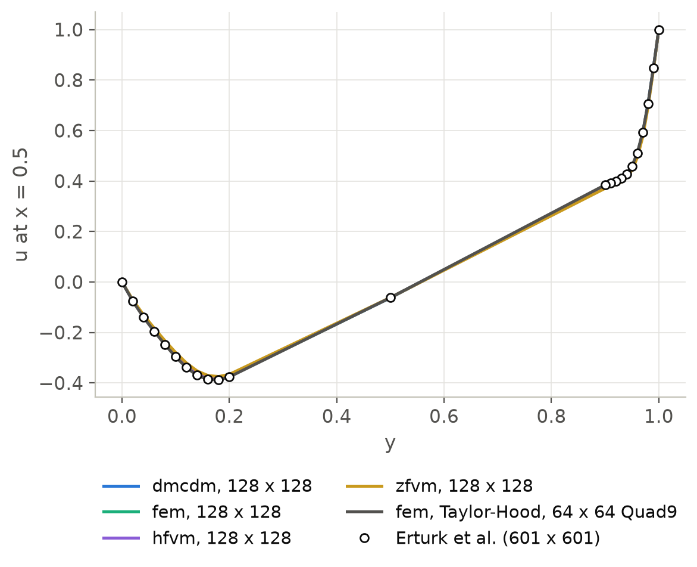
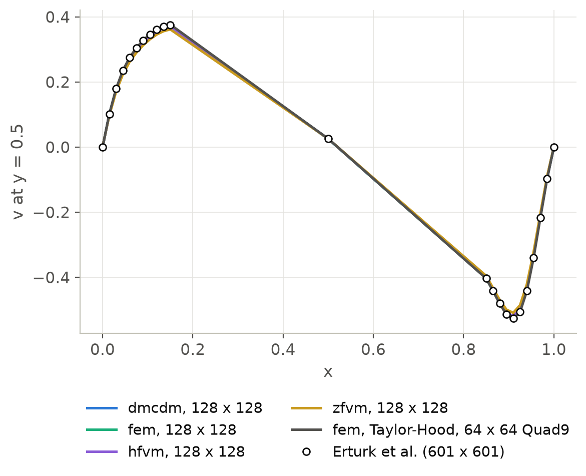
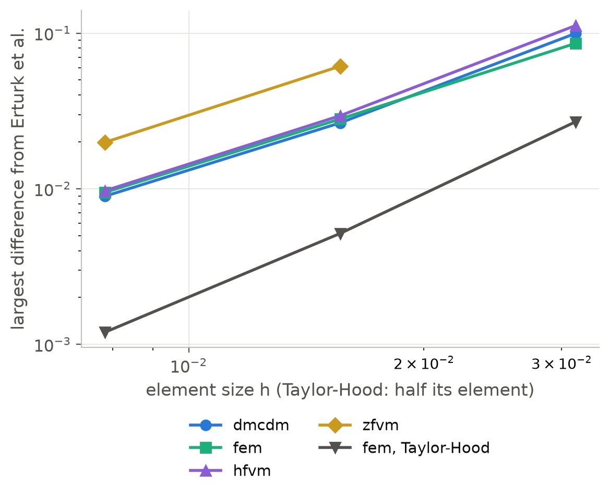

F5: Lid-driven cavity at Re = 1000
===================================

The problem
-----------

The unit square is filled with a fluid whose top side, the lid, slides at the
speed 1 and whose other sides are at rest.  With the density :math:`Re = 1000`
and the viscosity 1 the Reynolds number is 1000.  The steady flow is one large
vortex with two smaller ones in the lower corners.  Erturk, Corke and
Gokcol [Erturk2005]_ solved it on a :math:`601 \times 601` grid to residuals below
:math:`10^{-10}` and tabulated the velocity :math:`u` along the vertical
centerline :math:`x = 0.5` and :math:`v` along the horizontal centerline
:math:`y = 0.5` (their Tables 6 and 7).  Every method is compared with these 23
values of each profile on uniform meshes of :math:`n \times n` ``Quad4``
elements, by the largest difference.

The setup
---------

.. code-block:: python

   import numpy as np
   import dualmesh as dm

   mesh = dm.generate_rectangle_mesh(0, 1, 0, 1, 128, 128)
   problem = dm.Problem(mesh, method="dmcdm")  # fem, hfvm, zfvm
   problem.add_physics(
       "incompressible_flow",
       "flow",
       velocities=["u", "v"],
       dynamic_viscosity=1.0,
       density=1000.0,
       formulation="pressure",
       pressure_pin_point=(0.5, 0.0),
   )
   problem.add_boundary_condition(
       "Dirichlet_boundary_condition", "lid", variable="u", boundary="top", value=1.0,
       scale_with_load=True,
   )
   problem.add_boundary_condition(
       "Dirichlet_boundary_condition", "lid_v", variable="v", boundary="top", value=0.0
   )
   for variable in ("u", "v"):  # added last, so that the top corners belong to the walls
       problem.add_boundary_condition(
           "Dirichlet_boundary_condition", f"walls_{variable}", variable=variable,
           boundary=["left", "right", "bottom"], value=0.0,
       )
   problem.solve(load_factors=list(np.linspace(0.1, 1.0, 10)))

Newton's method reaches the steady state with the lid speed raised in ten load
steps.  The Taylor-Hood element takes ``formulation="Taylor_Hood"`` on ``Quad9``
elements, half as many per side.  The projection time integration
(``time_integration="projection"``) marches the flow from rest on the
:math:`64 \times 64` mesh at a Courant number of one half until the velocity
changes by less than :math:`10^{-7}` per unit time, which it does by
:math:`t = 150`.

Results
-------

.. list-table:: Largest difference from the centerline velocities of
   [Erturk2005]_ (Taylor-Hood: :math:`n/2 \times n/2` ``Quad9`` elements)
   :header-rows: 1
   :widths: 30 14 14 14 14 14

   * - Method
     - :math:`u`, :math:`n = 32`
     - :math:`u`, 64
     - :math:`u`, 128
     - :math:`v`, 64
     - :math:`v`, 128
   * - dmcdm
     - 0.0741
     - 0.0198
     - 0.0062
     - 0.0265
     - 0.0089
   * - fem
     - 0.0630
     - 0.0188
     - 0.0059
     - 0.0281
     - 0.0095
   * - hfvm
     - 0.0856
     - 0.0233
     - 0.0070
     - 0.0295
     - 0.0097
   * - zfvm
     - (none)
     - 0.0613
     - 0.0173
     - 0.0568
     - 0.0199
   * - fem, Taylor-Hood
     - 0.0251
     - 0.0052
     - 0.0012
     - 0.0042
     - 0.0011
   * - dmcdm, projection
     -
     - 0.0340
     -
     - 0.0354
     -
   * - fem, projection
     -
     - 0.0121
     -
     - 0.0276
     -
   * - hfvm, projection
     -
     - 0.0360
     -
     - 0.0388
     -

The three node methods converge to the reference at an order between 1.6 and
1.9: the difference falls by a factor of 3.0 to 3.8 from :math:`n = 32` to 64
and from 64 to 128, and is below 0.01 on the :math:`128 \times 128` mesh.  The quadratic velocity of the
Taylor-Hood element is about five times closer on the same number of nodes.  The
cell-centered method has no converged solution on :math:`32 \times 32` cells:
Newton's method diverges, with five and with ten load steps.  On finer meshes it
converges to the reference, about three times farther from it than the node
methods.  On :math:`256 \times 256` cells its Newton iterations with the serial
direct solver take more than the ten minutes allowed to one run on the
development laptop, and that mesh is left out.

The projection time integration reaches a steady state that is closer to the
reference than the monolithic solution for the finite element method and
farther for the two methods of the dual mesh.  The monolithic solves carry the
streamline stabilization of the advection, and the splitting has none: at the
cell Reynolds number of about 16 of the :math:`64 \times 64` mesh, the methods of
the dual mesh need it more than the finite element method.  Taking the
integrals of the dual mesh with two points per direction, against one, changes
the difference of dmcdm from 0.0340 to 0.0326, so the quadrature is not the
cause.

   The velocity :math:`u` along the vertical centerline.

   The velocity :math:`v` along the horizontal centerline.

   The largest difference from [Erturk2005]_ against the element size.

Reproducing the results
-----------------------

.. code-block:: console

   python verification/benchmarks/fluids/run_cavity.py              # about 8 minutes
   python verification/benchmarks/fluids/run_cavity.py --plot-only  # the figures only
