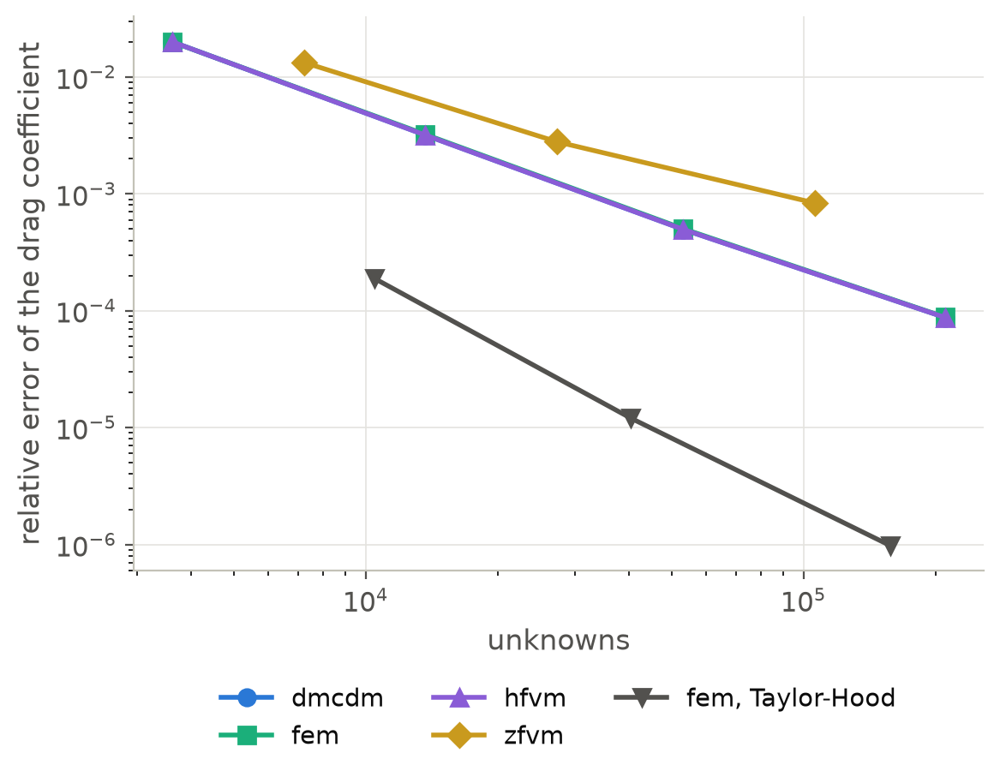
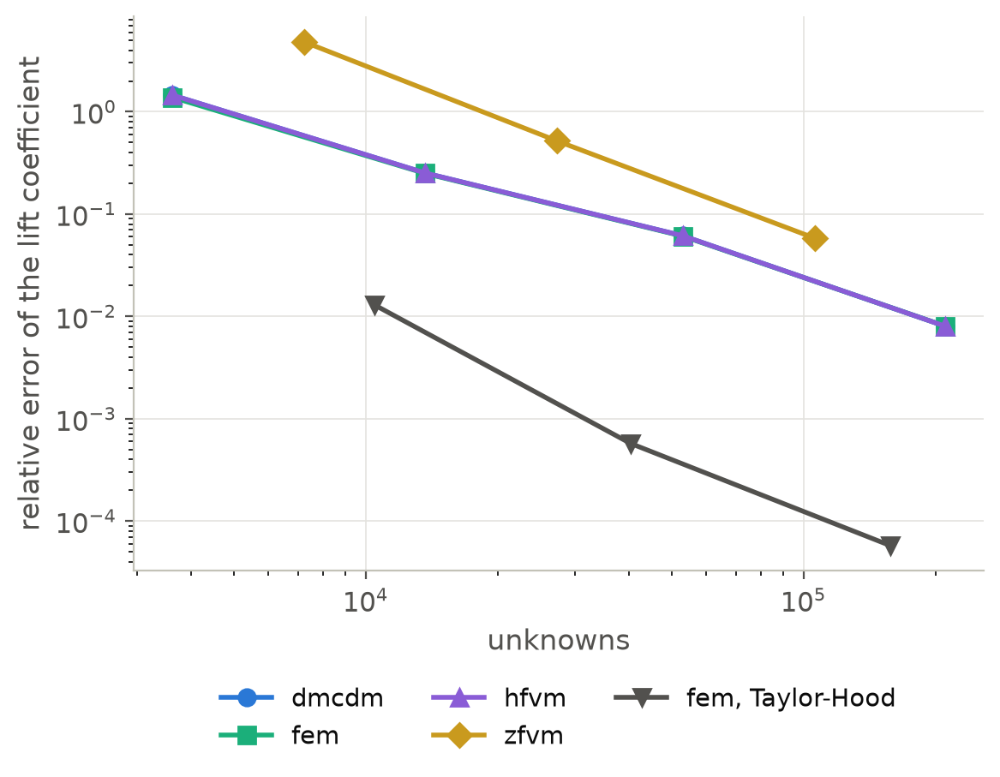
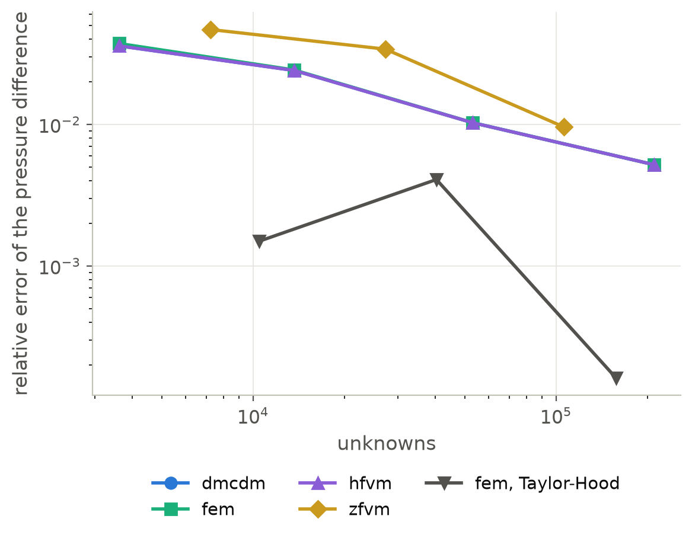

F1: Flow around a cylinder, steady (DFG 2D-1)
=============================================

The problem
-----------

The DFG benchmark of Schäfer and Turek [SchaeferTurek1996]_ places a cylinder
of diameter :math:`D = 0.1`, centered at :math:`(0.2, 0.2)`, in the channel
:math:`[0, 2.2] \times [0, 0.41]`, slightly below its axis, so that the flow
around it is not symmetric and the cylinder carries a small lift.  The inflow is
the parabola :math:`u = 4 U y (0.41 - y) / 0.41^2` with :math:`U = 0.3`, the
walls and the cylinder hold the fluid at rest, and the outflow :math:`x = 2.2`
is the do-nothing condition :math:`\nu\, \partial \mathbf{v} / \partial n - p
\mathbf{n} = 0`.  With the density 1 and the viscosity :math:`\nu = 0.001`, the
Reynolds number :math:`Re = \bar{U} D / \nu` is 20, with the mean velocity
:math:`\bar{U} = 2U/3 = 0.2`, and the flow is steady.  The benchmark asks for
the drag and lift coefficients :math:`C = 2F / (\bar{U}^2 D)` of the force
:math:`F` on the cylinder and for the pressure difference
:math:`\Delta p = p(0.15, 0.2) - p(0.25, 0.2)` between its front and its back.
The reference values of the FEATFLOW benchmark pages are
:math:`C_D = 5.57953523384`, :math:`C_L = 0.010618948146` and
:math:`\Delta p = 0.11752016697`.

The setup
---------

Gmsh meshes the channel in triangles, graded from the size :math:`h` on the
cylinder to :math:`4h` at the distance 0.3 from it
(``verification/benchmarks/fluids/dfg_mesh.py``), with
:math:`h = 0.01, 0.005, 0.0025, 0.00125`.  The Laplacian form of the viscous term
makes the do-nothing condition the natural one, so the outflow needs no
condition.  The force on the cylinder is minus the sum of the reactions of its
prescribed velocities:

.. code-block:: python

   import dualmesh as dm

   mesh = dm.read_mesh("dfg.msh")
   problem = dm.Problem(mesh, method="dmcdm")  # fem, hfvm, zfvm
   problem.add_physics(
       "incompressible_flow",
       "flow",
       velocities=["u", "v"],
       density=1.0,
       dynamic_viscosity=1e-3,
       formulation="pressure",
       viscous_form="laplacian",
   )
   problem.add_boundary_condition(
       "Dirichlet_boundary_condition", "inflow_u", variable="u", boundary="inlet",
       value="4*0.3*y*(0.41 - y)/0.41^2", scale_with_load=True,
   )
   problem.add_boundary_condition(
       "Dirichlet_boundary_condition", "inflow_v", variable="v", boundary="inlet", value=0.0
   )
   for variable in ("u", "v"):
       problem.add_boundary_condition(
           "Dirichlet_boundary_condition", f"no_slip_{variable}", variable=variable,
           boundary=["walls", "cylinder"], value=0.0,
       )
   problem.solve()  # zfvm: load_factors=[0.25, 0.5, 0.75, 1.0]
   drag = -2 / (0.2**2 * 0.1) * problem.total_reaction("u", "cylinder")
   lift = -2 / (0.2**2 * 0.1) * problem.total_reaction("v", "cylinder")
   p_front, p_back = problem.sample("pressure", [[0.15, 0.2], [0.25, 0.2]])

The Taylor-Hood element takes ``formulation="Taylor_Hood"`` on quadratic
triangles twice as large, whose sides on the cylinder lie on the circle.

Results
-------

.. list-table:: The coefficients on the finest mesh of every method, and their
   relative errors
   :header-rows: 1
   :widths: 22 14 18 16 18

   * - Method
     - unknowns
     - :math:`C_D`
     - :math:`C_L`
     - :math:`\Delta p`
   * - dmcdm, hfvm
     - 210 429
     - 5.58002 (+0.009 %)
     - 0.01053 (-0.8 %)
     - 0.11691 (-0.52 %)
   * - fem
     - 210 429
     - 5.58003 (+0.009 %)
     - 0.01053 (-0.8 %)
     - 0.11691 (-0.52 %)
   * - zfvm
     - 106 098
     - 5.58419 (+0.084 %)
     - 0.01000 (-5.8 %)
     - 0.11639 (-0.96 %)
   * - fem, Taylor-Hood
     - 157 743
     - 5.57953 (-0.000 %)
     - 0.01062 (+0.01 %)
     - 0.11750 (-0.016 %)
   * - Reference
     -
     - 5.57954
     - 0.010619
     - 0.117520

The drag of every method converges to the reference, at about second order in
the element size for the equal-order elements: its error falls from 2 % on the
coarsest mesh to 0.3 %, 0.05 % and 0.009 % as the element size is halved.  The
lift, a hundredth of the drag and the difference of two nearly equal forces on
the two sides of the cylinder, has the wrong sign on the coarsest mesh of every
equal-order method and converges from the second mesh on.  The pressure
difference converges at about first order, since the pressure of the stabilized
equal-order elements is first-order accurate at points.  On triangles the dual
mesh control domain and the vertex-centered finite volume methods give the
same numbers, because the edge difference of a linear triangle is its
interpolated gradient, and their drag agrees with that of the finite element
method to 0.003 %.  The Taylor-Hood element, with its curved sides on the cylinder
and its quadratic velocity, reproduces every printed digit of the reference
drag and lift on 158 000 unknowns.  The cell-centered method needs the inflow
raised in four load steps on the coarsest mesh, where Newton's method diverges
from the full inflow, and its direct solves take longest, so its finest mesh is
left out.

   The relative error of the drag coefficient against the number of unknowns.

   The relative error of the lift coefficient against the number of unknowns.

   The relative error of the pressure difference against the number of unknowns.

Reproducing the results
-----------------------

.. code-block:: console

   pip install gmsh
   python verification/benchmarks/fluids/run_dfg_steady.py              # about 16 minutes
   python verification/benchmarks/fluids/run_dfg_steady.py --plot-only  # the figures only
