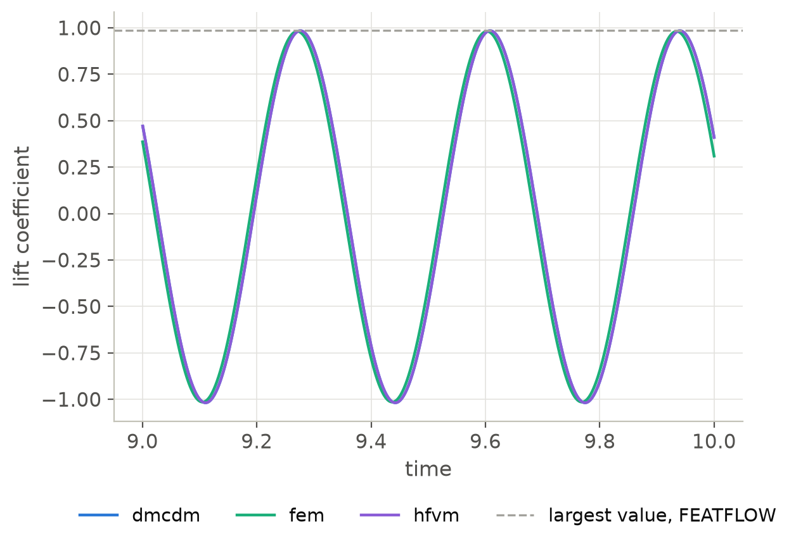
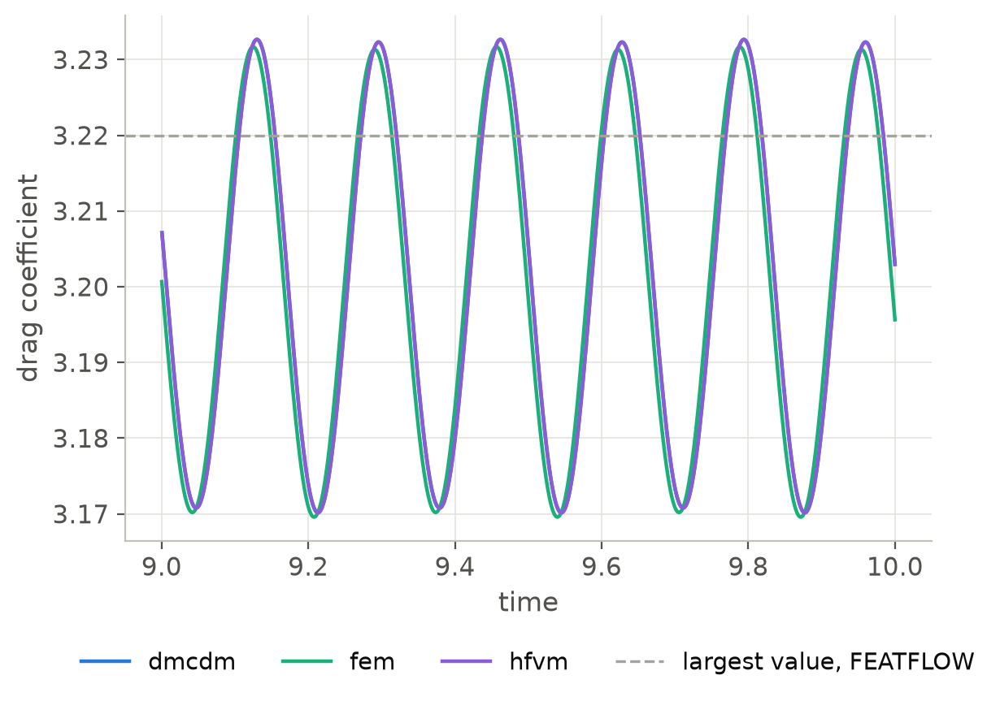

F2: Flow around a cylinder, vortex shedding (DFG 2D-2)
======================================================

The problem
-----------

The geometry and the boundary conditions are those of :doc:`dfg_steady`, with
the inflow :math:`u = 4 U y (0.41 - y) / 0.41^2` of :math:`U = 1.5`, so that the
mean velocity is :math:`\bar{U} = 1` and the Reynolds number
:math:`\bar{U} D / \nu = 100` [SchaeferTurek1996]_.  At this Reynolds number the
wake of the cylinder is unstable: vortices are shed from its two sides in turn,
and the drag and the lift oscillate with the frequency :math:`f` of the
shedding.  The benchmark asks for the largest drag and lift coefficients of a
cycle and for the Strouhal number :math:`St = D f / \bar{U}`.  The reference
values of the FEATFLOW benchmark pages, computed with :math:`Q_2/P_1^{disc}`
elements on 667 264 unknowns and the Crank-Nicolson method with the step
:math:`1/200`, are :math:`\max C_D = 3.2200`, :math:`\max C_L = 0.9859` and
:math:`St = 0.30188`.

The setup
---------

The flow starts from rest and is advanced by the projection time integration
(BDF2 and EXT2) at a Courant number of one half, distributed over four
processes.  The splitting takes the do-nothing outflow as a prescribed pressure
of zero, with the natural condition :math:`\nu\, \partial \mathbf{v} / \partial n
= 0` on the velocity.  The forces on the cylinder are minus the sums of the
reactions of its prescribed velocities, which the projection time integration
computes at every step from its momentum equations.

.. code-block:: python

   import dualmesh as dm

   mesh = dm.read_mesh("dfg.msh")
   problem = dm.Problem(mesh, method="dmcdm")  # fem, hfvm
   problem.add_physics(
       "incompressible_flow",
       "flow",
       velocities=["u", "v"],
       density=1.0,
       dynamic_viscosity=1e-3,
       formulation="pressure",
       time_integration="projection",
   )
   problem.add_boundary_condition(
       "Dirichlet_boundary_condition", "inflow_u", variable="u", boundary="inlet",
       value="4*1.5*y*(0.41 - y)/0.41^2",
   )
   problem.add_boundary_condition(
       "Dirichlet_boundary_condition", "inflow_v", variable="v", boundary="inlet", value=0.0
   )
   for variable in ("u", "v"):
       problem.add_boundary_condition(
           "Dirichlet_boundary_condition", f"no_slip_{variable}", variable=variable,
           boundary=["walls", "cylinder"], value=0.0,
       )
   problem.add_boundary_condition(
       "Dirichlet_boundary_condition", "outflow", variable="pressure", boundary="outlet", value=0.0
   )
   forces = []
   problem.set_time_step_callback(
       lambda t, _: forces.append(
           (t, -20 * problem.total_reaction("u", "cylinder"), -20 * problem.total_reaction("v", "cylinder"))
       )
   )
   problem.solve_transient(end_time=10.0, time_step=1e-3, time_stepper="cfl", courant_number=0.5)

The shedding is periodic from about :math:`t = 7`.  The last three cycles before
:math:`t = 10`, each from one minimum of the lift to the next, give the period,
and the largest drag and lift coefficients are taken over them.

Results
-------

.. list-table:: The largest drag and lift coefficients of a cycle and the
   Strouhal number, with their relative errors, and the wall time of one step on
   four processes of a laptop
   :header-rows: 1
   :widths: 20 12 18 18 18 14

   * - Method
     - unknowns
     - :math:`\max C_D`
     - :math:`\max C_L`
     - :math:`St`
     - s per step
   * - fem
     - 13 665
     - 3.2941 (+2.30 %)
     - 0.9910 (+0.51 %)
     - 0.29827 (-1.20 %)
     - 0.0040
   * - fem
     - 53 049
     - 3.2317 (+0.36 %)
     - 0.9809 (-0.51 %)
     - 0.30138 (-0.17 %)
     - 0.020
   * - dmcdm, hfvm
     - 13 665
     - 3.3010 (+2.52 %)
     - 1.0061 (+2.05 %)
     - 0.29747 (-1.46 %)
     - 0.0027
   * - dmcdm, hfvm
     - 53 049
     - 3.2327 (+0.39 %)
     - 0.9844 (-0.15 %)
     - 0.30122 (-0.22 %)
     - 0.012
   * - Reference
     - 667 264
     - 3.2200
     - 0.9859
     - 0.30188
     -

Halving the element size divides the error of the largest drag by six, that of
the Strouhal number by seven and that of the largest lift by between one and
fourteen, so all three converge to the reference.  On 53 049 unknowns, a
twelfth of those of the reference computation, the largest drag is within
0.4 %, the largest lift within 0.5 % and the Strouhal number within 0.22 %.  The
dual mesh control domain and the vertex-centered methods give the same numbers
on these triangles, for the reason given in :doc:`dfg_steady`, and their steps
took a third to 40 % less time than those of the finite element method.  A step of the
finer mesh takes 12 to 20 ms on four processes, and the run of ten time units,
about 19 000 steps at a Courant number of one half, takes four to six minutes.

   The lift coefficient over the last three cycles on the finer mesh.

   The drag coefficient over the last three cycles on the finer mesh.

Reproducing the results
-----------------------

.. code-block:: console

   pip install gmsh
   mpirun -n 4 python verification/benchmarks/fluids/run_dfg_unsteady.py --method dmcdm  # about 6 minutes each
   mpirun -n 4 python verification/benchmarks/fluids/run_dfg_unsteady.py --method fem
   mpirun -n 4 python verification/benchmarks/fluids/run_dfg_unsteady.py --method hfvm
   python verification/benchmarks/fluids/run_dfg_unsteady.py --plot-only
