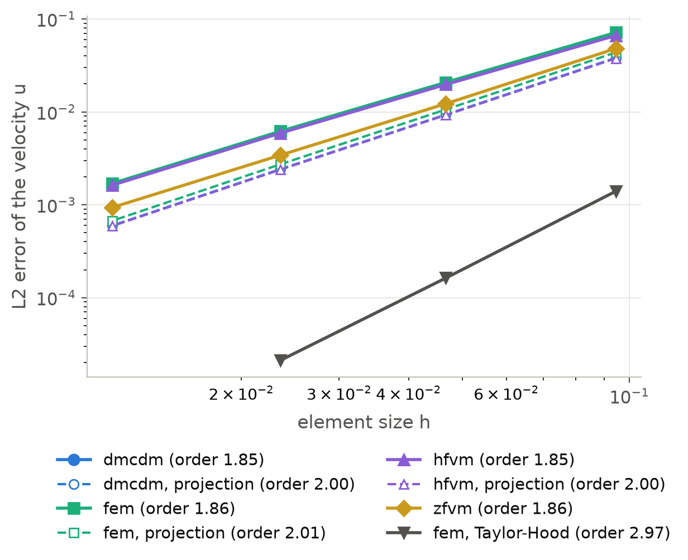
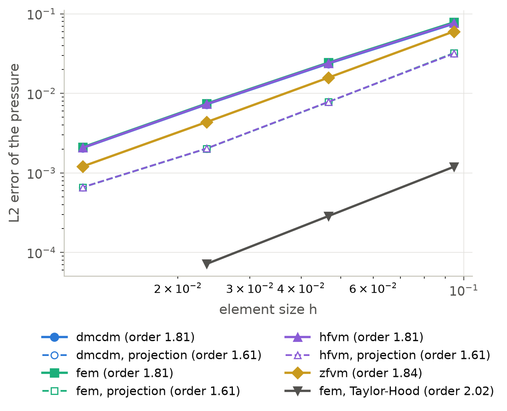

F4: Kovasznay flow
==================

The problem
-----------

Kovasznay [Kovasznay1948]_ found the flow behind a row of cylinders in closed
form.  At the Reynolds number :math:`Re = \rho U L / \mu = 40`, with the density 1
and the viscosity :math:`1 / Re`, the velocity and the pressure

.. math::

   u = 1 - e^{\lambda x} \cos 2\pi y , \qquad
   v = \frac{\lambda}{2\pi} e^{\lambda x} \sin 2\pi y , \qquad
   p = \tfrac{1}{2} \left( 1 - e^{2\lambda x} \right) , \qquad
   \lambda = \frac{Re}{2} - \sqrt{\frac{Re^2}{4} + 4\pi^2} ,

satisfy the steady Navier-Stokes equations without a body force.  The script
checks this: the body force that would make the fields a solution, computed
symbolically, is below :math:`4 \times 10^{-15}` at 200 points of the domain.
The flow is solved on :math:`[-0.5, 1] \times [-0.5, 1.5]`, which contains one
period in :math:`y` and the decay of the wake in :math:`x`.  Every method is checked against the exact fields in the
:math:`L^2` norm, on meshes of :math:`n \times 4n/3` ``Quad4`` elements with
:math:`n = 16, 32, 64, 128`.

The setup
---------

The monolithic solves prescribe the exact velocity on the left, bottom and top
sides and the exact traction on the outflow side :math:`x = 1`, through
:class:`~dualmesh.mms.ManufacturedSolution`, which also starts Newton's method
from the exact fields:

.. code-block:: python

   import math
   import dualmesh as dm
   from dualmesh import mms

   Re = 40.0
   lam = Re / 2 - math.sqrt(Re**2 / 4 + 4 * math.pi**2)
   fields = {
       "u": f"1 - exp({lam}*x)*cos(2*pi*y)",
       "v": f"{lam / (2 * math.pi)}*exp({lam}*x)*sin(2*pi*y)",
       "pressure": f"(1 - exp({2 * lam}*x))/2",
   }
   study = mms.ManufacturedSolution(fields, dimension=2, flux_boundaries={"right": (1.0, 0.0)})
   study.add_physics(
       "incompressible_flow",
       "flow",
       velocities=["u", "v"],
       density=1.0,
       dynamic_viscosity=1.0 / Re,
       formulation="pressure",  # or "Taylor_Hood" on Quad9 elements
   )
   result = study.convergence_study(
       lambda n: dm.generate_rectangle_mesh(-0.5, 1.0, -0.5, 1.5, n, round(4 * n / 3)),
       [16, 32, 64, 128],
       method="dmcdm",  # fem, hfvm, zfvm
   )

The projection time integration marches the flow from the exact fields to its
steady state, for ten time units at a Courant number of one half.  The
errors at ten and at twenty time units agree to :math:`10^{-12}`.  The exact
velocity is prescribed on all four sides, which is the form of the problem that
the splitting takes: an outflow there would be a prescribed pressure (see
:doc:`../theory/heat_and_fluids`).

.. code-block:: python

   problem = dm.Problem(mesh, method="dmcdm")  # fem, hfvm
   problem.add_physics(
       "incompressible_flow",
       "flow",
       velocities=["u", "v"],
       density=1.0,
       dynamic_viscosity=1.0 / Re,
       formulation="pressure",
       time_integration="projection",
   )
   for variable in ("u", "v"):
       problem.add_boundary_condition(
           "Dirichlet_boundary_condition",
           f"exact_{variable}",
           variable=variable,
           boundary=["left", "right", "bottom", "top"],
           value=fields[variable],
       )
   problem.solve_transient(end_time=10.0, time_step=1e-3, time_stepper="cfl", courant_number=0.5)

Its pressure, known up to a constant in an enclosed flow, is compared after both
fields are shifted to the same mean.

Results
-------

.. list-table:: Errors on the finest mesh and orders between the two finest
   meshes (the Taylor-Hood element on :math:`64 \times 85` ``Quad9`` elements)
   :header-rows: 1
   :widths: 34 22 22

   * - Method
     - velocity :math:`u`, :math:`L^2` (order)
     - pressure, :math:`L^2` (order)
   * - dmcdm
     - :math:`1.64 \times 10^{-3}` (1.85)
     - :math:`2.06 \times 10^{-3}` (1.81)
   * - fem
     - :math:`1.70 \times 10^{-3}` (1.86)
     - :math:`2.11 \times 10^{-3}` (1.81)
   * - hfvm
     - :math:`1.63 \times 10^{-3}` (1.85)
     - :math:`2.08 \times 10^{-3}` (1.81)
   * - zfvm
     - :math:`9.35 \times 10^{-4}` (1.86)
     - :math:`1.21 \times 10^{-3}` (1.84)
   * - fem, Taylor-Hood
     - :math:`2.11 \times 10^{-5}` (2.97)
     - :math:`7.17 \times 10^{-5}` (2.02)
   * - dmcdm, projection
     - :math:`5.97 \times 10^{-4}` (2.00)
     - :math:`6.60 \times 10^{-4}` (1.61)
   * - fem, projection
     - :math:`6.72 \times 10^{-4}` (2.01)
     - :math:`6.61 \times 10^{-4}` (1.61)
   * - hfvm, projection
     - :math:`5.90 \times 10^{-4}` (2.00)
     - :math:`6.61 \times 10^{-4}` (1.61)

Every method converges to the exact solution at its expected order: second
order in the velocity for the equal-order elements and the cell-centered
method, third order for the quadratic velocity of the Taylor-Hood element, and
between 1.6 and 2 in the pressure, above the first order that the theory of the
stabilized equal-order methods guarantees.  The three node methods give nearly
the same errors.  The cell-centered method's errors are about half those of the
node methods on the same mesh, whose cells are about as many as the nodes of the
node methods.  The projection time integration reaches a steady state that is closer to
the exact one than the monolithic solution, because its problem prescribes the
velocity on all four sides, whereas the monolithic problem has the traction on
one.

   The :math:`L^2` error of the velocity :math:`u` against the element size.

   The :math:`L^2` error of the pressure against the element size.

Reproducing the results
-----------------------

.. code-block:: console

   python verification/benchmarks/fluids/run_kovasznay.py              # about 3 minutes
   python verification/benchmarks/fluids/run_kovasznay.py --plot-only  # the figures only
