.. _fuel_benchmarks:

Fuel performance benchmarks
===========================

.. contents::
   :local:
   :depth: 2
   :class: this-will-duplicate-information-and-it-is-still-useful-here

This chapter compares :mod:`dualmesh.fuel` with measurements and with other
fuel performance codes.  Every case is run by a script in
``verification/benchmarks``, which also draws the figures of this chapter.
Wherever BISON results are published for the same case, dualmesh is held to
be at least as close to the measurement as BISON.  The measurements and the
results of the other codes are taken from the tables and figures of the
reports cited with each case.  The TRISO benchmark CRP-6 is in
:doc:`triso`.

The models
----------

All cases use the default models of :mod:`dualmesh.fuel` (see
:doc:`models` and :doc:`correlations`):

* Heat conduction in the fuel with the conductivity of Fink (2000) and the
  irradiation factors of Lucuta, Matzke and Hastings (1996), and in the
  Zircaloy-4 cladding with the MATPRO conductivity.
* Heat transfer across the gap by gas conduction, radiation and solid
  contact (Ross and Stoute 1962), with the mixture conductivity of the fill
  gas and the released gas.
* Fuel relocation (ESCORE), densification (ESCORE), solid swelling
  (MATPRO) and gaseous swelling from the volume of the gas bubbles of the
  fission gas model (Pastore et al. 2013, Eqs. 9 and 10), thermal
  expansion and creep of fuel and cladding, and frictionless contact.
* The gas pressure from the ideal gas law over the plenum, the gap, the
  bore of annular pellets and the cracks opened by relocation.
* Fission gas: diffusion in the grains (Booth, with the Turnbull
  coefficient), trapping in and re-solution from intragranular bubbles,
  grain-face bubbles that grow by vacancy absorption, coalesce and vent at
  saturation (White 2004, Pastore et al. 2013), and burst release by
  micro-cracking of the grain faces on temperature changes (Barani et al.
  2017).  Cr2O3-doped fuel has the doped diffusivity of Cooper et al.
  (2021) and the densification measured on the Halden rods.
* Time steps that land on the points of the power history, so that
  shutdowns and power steps are resolved.

UO2: FUMEX-II
-------------

The rods and the power histories are those of IAEA-TECDOC-1687 (2012).  The
scripts are ``verification/benchmarks/fumex2/run_fumex2.py`` and
``run_ifa534.py``.

Idealised cases 27(1), 27(2a) and 27(2b)
~~~~~~~~~~~~~~~~~~~~~~~~~~~~~~~~~~~~~~~~

A Halden type rod (Table 13 of the report) is irradiated at 15 kW/m to 100
MWd/kgU (27(2a)), at a power falling from 20 to 10 kW/m (27(2b)), and at
constant powers to find the centre temperature and burnup at which the
release reaches 1 % (27(1)).  The report has no measurements for these
cases.  It compares the codes with each other, and case 27(1) with the
empirical threshold of Vitanza, :math:`B^* = 5 \exp(9800/T_c)` with the
burnup :math:`B^*` in MWd/tU and the centre temperature :math:`T_c` in
degrees Celsius (Vitanza, Kolstad and Graziani 1979, Eq. 1).  Three inputs
that the report leaves open are chosen as follows: a grain radius of 7.5
micrometres (half the stated grain diameter), a 0.1 m stack with a plenum of
:math:`50\ \mathrm{cm^3}`, and a small fast flux.

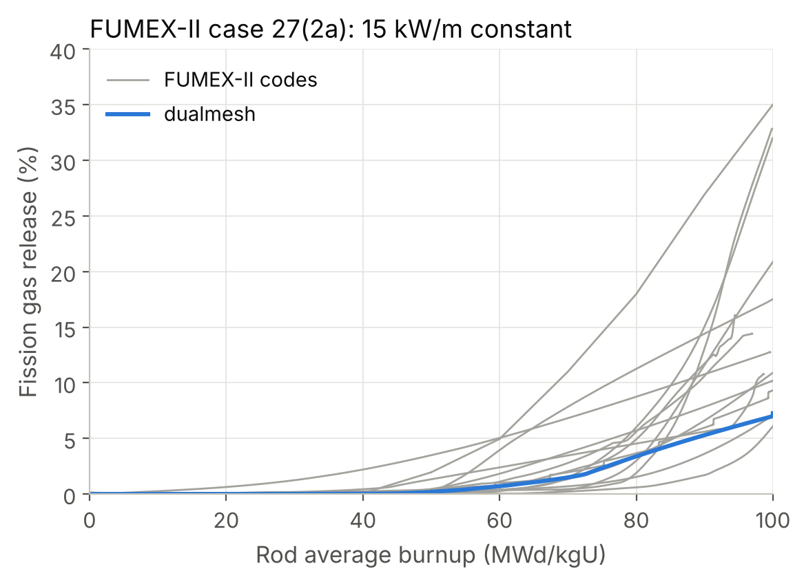

   FUMEX-II case 27(2a), constant linear heat rate of 15 kW/m: the fission
   gas release of dualmesh and of the codes of the exercise.

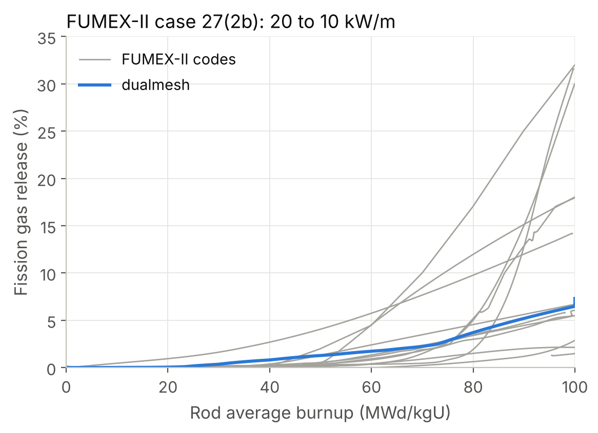

   FUMEX-II case 27(2b), linear heat rate falling from 20 to 10 kW/m: the
   fission gas release of dualmesh and of the codes of the exercise.

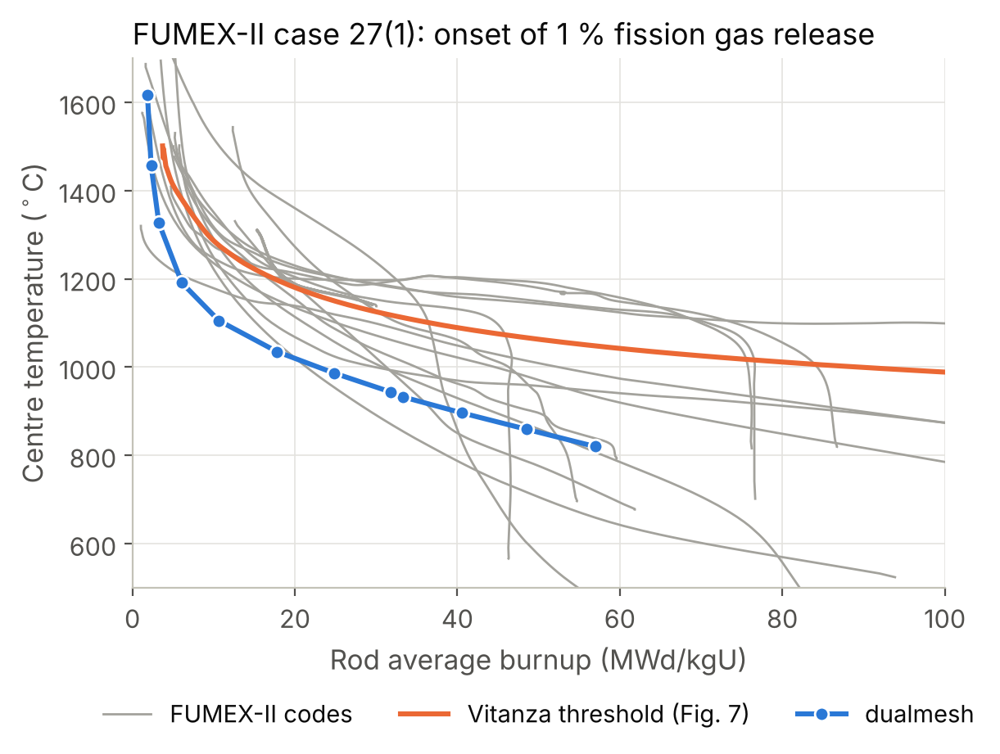

   FUMEX-II case 27(1): the onset of 1 % release.

dualmesh lies inside the spread of the codes in both idealised cases.  In
27(2a) it releases 0.2 % at 50 MWd/kgU and 7.3 % at 100 MWd/kgU, where most
codes give below 1 % and 1 to 35 %.  In 27(1) its onset of release lies 162
to 228 K below the Vitanza threshold at the 9 powers whose burnup lies
within the drawn threshold (185 K on average, the largest distance at the
lowest of them), at the lower edge of the codes.
At low power the grain-face bubbles fill slowly and release starts once
they saturate, which the Booth diffusion with the Turnbull coefficient
reaches at a lower temperature than the Halden data indicate.  The CASL
report notes the same early onset for BISON (CASL-U-2019-1870, printed page
35).

IFA-534.14 rods 18 and 19: the effect of the grain size
~~~~~~~~~~~~~~~~~~~~~~~~~~~~~~~~~~~~~~~~~~~~~~~~~~~~~~~

Two rods from the same base irradiation (52 MWd/kgUO2), with grain
diameters of 22.1 and 8.5 micrometres, were irradiated again in Halden.  The
release during the Halden irradiation was measured by puncture: 4.68 % for
rod 18 and 8.89 % for rod 19, the values of Figs. 21 and 22 of the report
and of the ratio 1.85 on its printed page 52 (the sentence on printed page
51 gives the two values interchanged).

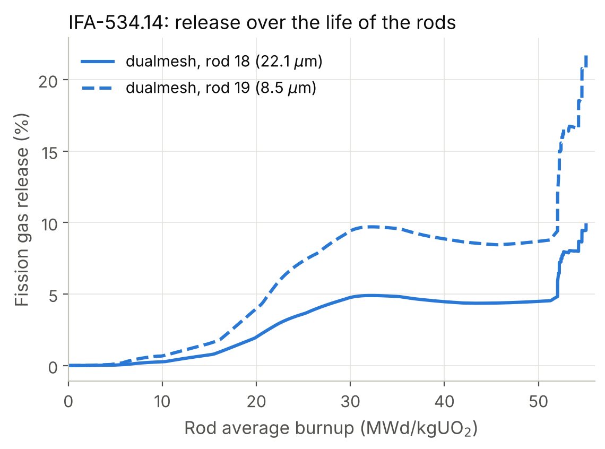

   IFA-534.14 rods 18 and 19: the fraction of the produced gas released
   over the life of the rods, computed by dualmesh.  The base irradiation
   ends at 52 MWd/kgUO2, and the Halden irradiation follows.

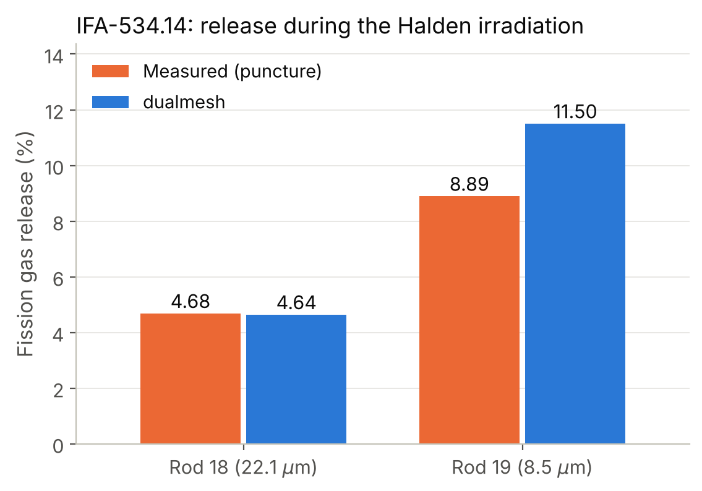

   IFA-534.14 rods 18 and 19: the release during the Halden irradiation,
   measured by puncture and computed by dualmesh.

dualmesh gives 4.64 % for rod 18 (measured 4.68 %) and 11.5 % for rod 19
(measured 8.89 %).  Most of the Halden release comes from the shutdowns and
start-ups of the Halden history, each of which cracks part of the grain
faces and vents their gas (Barani et al. 2017).  The release measured after
the refabrication shutdown is compared, since the gas released when the
rods cooled at the end of the base irradiation was removed at the
refabrication.  For rod 18 dualmesh lies 0.04 percentage points from the
measurement, the closest of the 20 FUMEX-II codes 0.06 and the next 0.34.
For rod 19, where dualmesh is 29 % high, 8 of the 20 codes are closer.  No BISON result is published for these rods.

Cr2O3-doped UO2: Halden IFA-716.1 rod 1
---------------------------------------

Rod 1 of IFA-716.1 held UO2 doped with 1580 ppm Cr2O3 with grains of 35
micrometres radius (CASL-U-2019-1870-000 Rev. 0, Sect. 4.1).  The script is
``verification/benchmarks/doped_uo2/run_ifa716.py``.  The rod data are
Table 4 of the report, the power history with its shutdowns is Fig. 8(b),
and the cladding temperature is the Halden correlation of FUMEX-II.  The
thermocouple sits in the drilled top section, so its calculation uses
pellets with a 1.8 mm bore.  Two BISON calculations are published, the CASL
report (2019) with the doped diffusivity of its Eq. 16, and Cooper et al.
(2021) with cases A and B of their doped diffusivity.

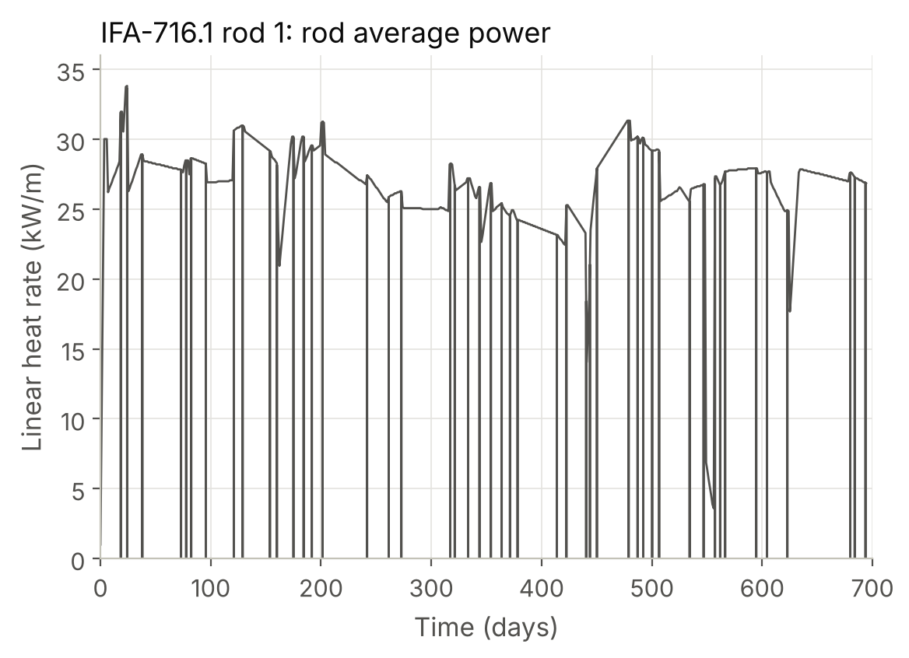

   IFA-716.1 rod 1: the rod average linear heat rate.

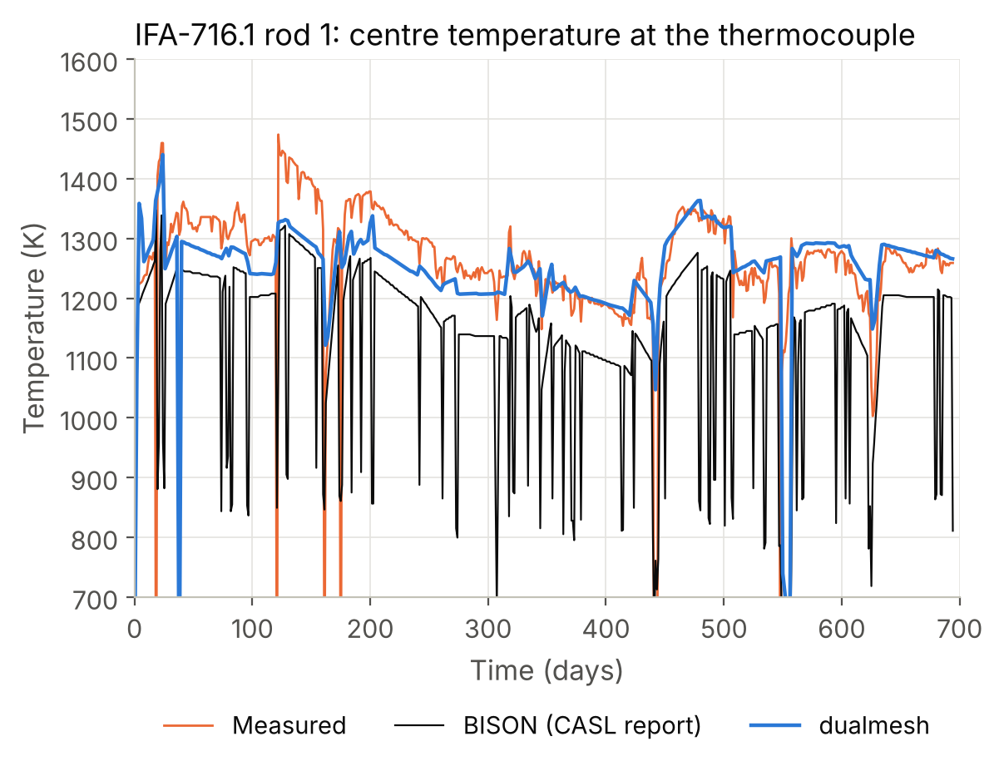

   IFA-716.1 rod 1: the centre temperature at the thermocouple, measured and
   computed by BISON and dualmesh.

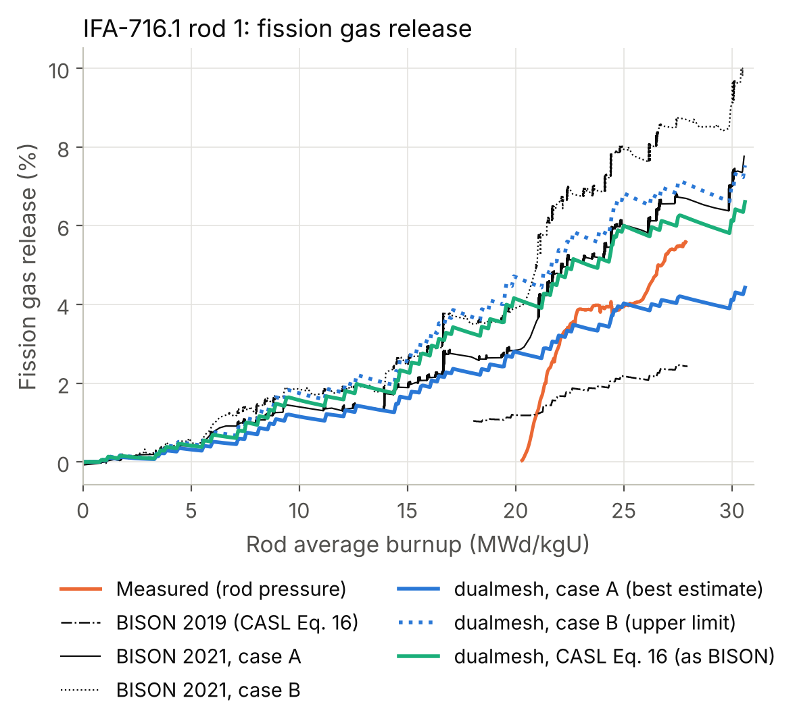

   IFA-716.1 rod 1: the fission gas release, measured (from the rod
   pressure) and computed by BISON and dualmesh with three doped
   diffusivities.

.. list-table:: IFA-716.1 rod 1, dualmesh and BISON against the measurements
   :header-rows: 1
   :widths: 46 18 18 18

   * - Quantity
     - dualmesh
     - BISON (2019, 2021)
     - Measured
   * - Thermocouple, median of calculated minus measured (K)
     - :math:`-9`
     - :math:`-94`, +92
     - 0
   * - Thermocouple, root mean square difference (K)
     - 48
     - 116, 158
     - 0
   * - Release at 620 days, doped case A (%)
     - 4.05
     - 6.70 (2021)
     - 5.6 :math:`\pm` 1.4
   * - Release at 620 days, doped case B (%)
     - 6.85
     - 8.71 (2021)
     - 5.6 :math:`\pm` 1.4
   * - Release at 620 days, CASL Eq. 16 diffusivity (%)
     - 6.02
     - 2.43 (2019)
     - 5.6 :math:`\pm` 1.4
   * - Root mean square difference from the measured release curve, case
       A, case B and CASL Eq. 16 (%)
     - 0.93, 2.44, 1.79
     - 1.87, 3.56 (2021), 1.99 (2019)
     -

dualmesh follows the thermocouple within 9 K in the median and 48 K root
mean square, less than half the difference of either BISON calculation.
Every doped diffusivity gives a release within or near the 1.4 %
uncertainty of the measurement at 620 days, and each is closer to the
measured release curve than the BISON calculation with the same
diffusivity: 0.93 % root mean square with case A (BISON 1.87 %) and 2.44 %
with case B (BISON 3.56 %).  With the CASL diffusivity dualmesh gives 6.02 %
against BISON's 2.43 % for a measured 5.6 %.

Cr2O3-doped UO2: Halden IFA-677.1 rods 1 and 5
----------------------------------------------

The high initial rating test IFA-677.1 irradiated doped rods 1 (28
micrometre grains) and 5 (22.5 micrometres) at about 40 kW/m to 29.8
MWd/kgU (CASL-U-2019-1870, Sect. 4.1).  The release inferred from the rod
pressure reached 22.1 % and 16.7 % (rod 5: 16 % by puncture).  The script
is ``verification/benchmarks/doped_uo2/run_ifa677.py``.  More than half of
each stack is drilled for the thermocouples at both ends.  Each rod is
computed with solid and with drilled pellets.  The releases are weighted by
the mass of the two lengths, and the drilled calculation gives the centre
temperature at the thermocouples.  The power histories with their
shutdowns are Fig. 8(a) of the report.

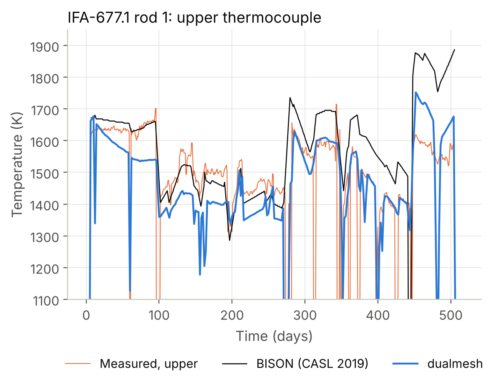

   IFA-677.1 rod 1: the centre temperature at the upper thermocouple,
   measured and computed by BISON and dualmesh.

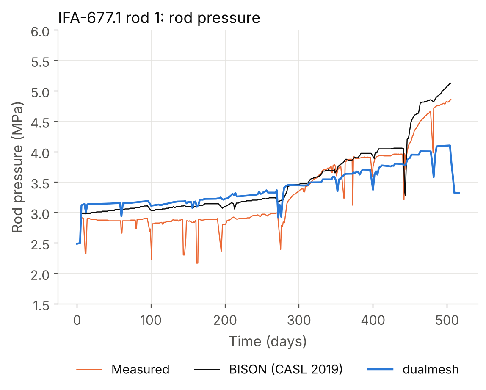

   IFA-677.1 rod 1: the rod internal pressure, measured and computed by
   BISON and dualmesh.

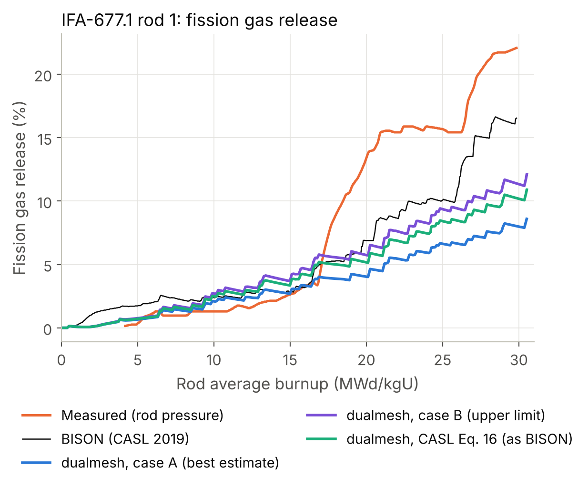

   IFA-677.1 rod 1: the fission gas release, measured (from the rod
   pressure) and computed by BISON and by dualmesh with the three
   doped diffusivities.

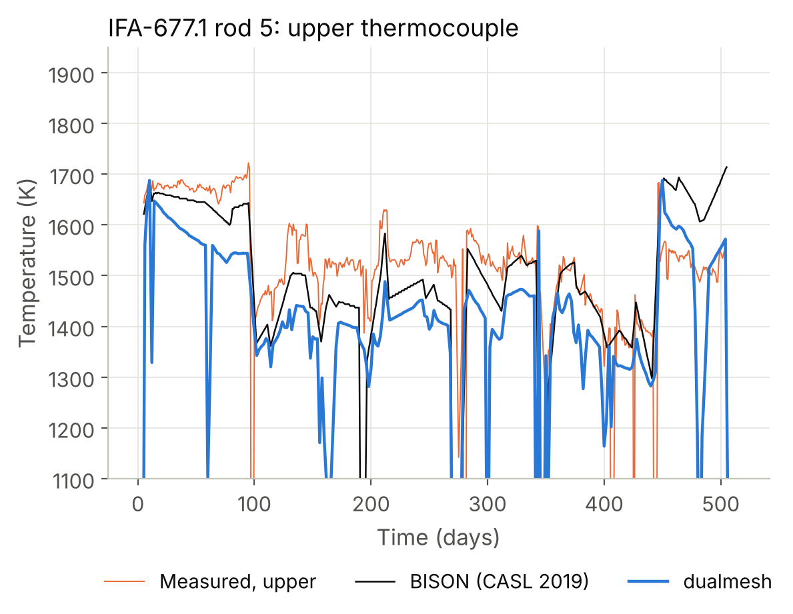

   IFA-677.1 rod 5: the centre temperature at the upper thermocouple,
   measured and computed by BISON and dualmesh.

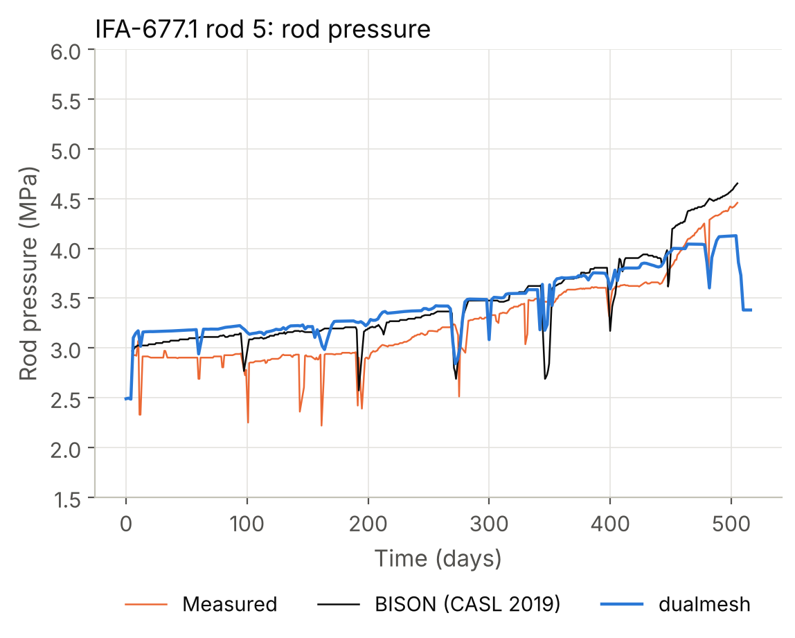

   IFA-677.1 rod 5: the rod internal pressure, measured and computed by
   BISON and dualmesh.

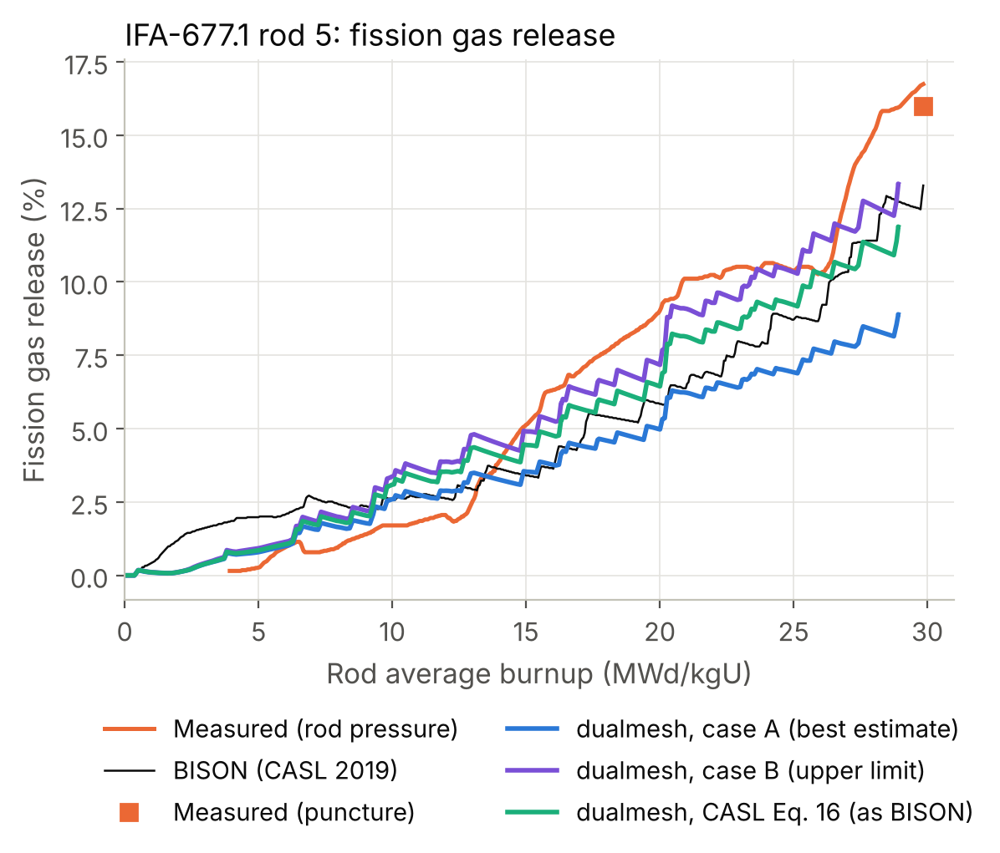

   IFA-677.1 rod 5: the fission gas release, measured (from the rod pressure
   and by puncture) and computed by BISON and by dualmesh with the three
   doped diffusivities.

.. list-table:: IFA-677.1, dualmesh (case A for the temperature and the
   pressure) and BISON (CASL 2019) against the measurements
   :header-rows: 1
   :widths: 52 16 16 16

   * - Quantity
     - dualmesh
     - BISON
     - Measured
   * - Rod 1, upper and lower thermocouples, root mean square difference (K)
     - 97, 103
     - 121, 137
     - 0
   * - Rod 1, upper and lower thermocouples, median difference (K)
     - :math:`-53`, :math:`-52`
     - +24, +15
     - 0
   * - Rod 5, upper and lower thermocouples, root mean square difference (K)
     - 161, 142
     - 108, 114
     - 0
   * - Rod 5, upper and lower thermocouples, median difference (K)
     - :math:`-104`, :math:`-83`
     - :math:`-39`, :math:`-17`
     - 0
   * - Rod 1 and rod 5, rod pressure at power, median difference (MPa)
     - 0.27, 0.22
     - 0.20, 0.20
     - 0
   * - Rod 1, release at 29.85 MWd/kgU, cases A, B and CASL Eq. 16 (%)
     - 8.0, 11.4, 10.3
     - 16.5
     - 22.1
   * - Rod 1, root mean square difference from the measured curve (%)
     - 7.2, 5.5, 6.1
     - 3.98
     -
   * - Rod 5, release at 29.85 MWd/kgU, cases A, B and CASL Eq. 16 (%)
     - 8.9, 13.4, 11.9
     - 13.3
     - 16.7 (16.0 puncture)
   * - Rod 5, root mean square difference from the measured curve (%)
     - 3.3, 1.4, 1.9
     - 2.21
     -

On rod 1 dualmesh follows both thermocouples more closely than BISON over
the whole irradiation.  BISON is closer in the first three cycles and 100
to 300 K above the data in the last three.  The CASL report attributes that
part to Halden powers that are expected to be too high in the second half
of the irradiation.  On rod 5, dualmesh is closer to the release curve than
BISON with the upper-limit diffusivity (case B) and with the CASL
diffusivity that BISON used.  The rod pressure at power is 0.22 to 0.27 MPa
(7 to 9 %) above the measurement, about as much as BISON's 0.20 MPa.

Work in progress
----------------

The following parts of the fuel benchmarks are not finished.

* **IFA-677.1 rod 1, fission gas release.** dualmesh releases 8 to 11 %
  against 16.5 % for BISON and 22.1 % measured.  The measured release rises
  from 3.5 to 15 % between 16.5 and 20 MWd/kgU, when the rod returns to 42
  kW/m after the third cycle, and dualmesh does not reproduce that step.
* **IFA-677.1 temperatures in the first three cycles.** dualmesh is 83 to
  119 K below the thermocouples of both rods at 35 to 43 kW/m, while its
  first days at power agree with them.  In the first 6 MWd/kgU the
  calculated temperature falls by about 140 K at constant power as the gap
  closes, while the measured temperature stays constant.  The rod 5
  thermocouples do not yet meet the BISON comparison.
* **Default doped diffusivity.** Case A (the best estimate of Cooper et
  al., the default) is the closest to the measured release of IFA-716.1,
  and case B (their upper limit) to that of IFA-677.1 rod 5.  The default
  will be settled on all the doped rods together.
* **Onset of release at low power (27(1)).** The compression of the
  grain-face bubbles by the hydrostatic stress of the fuel (Pastore et al.
  2013, Eq. 11) delays the onset at low power.  It will use the stress of
  the mechanics solution, which the fission gas model does not yet receive.
* **Uncertainty of the results.** Each result above is one calculation with
  nominal inputs.  The uncertainty and sensitivity module, which will give
  every benchmark result a standard deviation from the uncertainties of the
  model parameters and the inputs, is in development.
* **Other fuel and cladding types.** The benchmarks of U3Si2 and UN fuels,
  and of FeCrAl, SiC and Cr-coated cladding, are not done yet.  The cases
  found in the public literature are the ACTOF benchmark of
  IAEA-TECDOC-1921 (FeCrAl and Zircaloy-4), the ATF-13 R4 and ATF-15 R6
  rodlets and the rodlet of Metzger et al. (ICAPP 2014) for U3Si2, the INL
  report INL/JOU-20-58799 for SiC cladding, and the QUENCH-L1 and
  IFA-650.10 cases of Aragon et al. (2025) for Cr-coated Zircaloy.  No UN
  case with published inputs and results was found.
