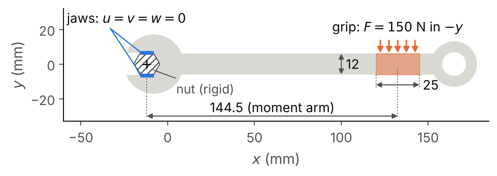
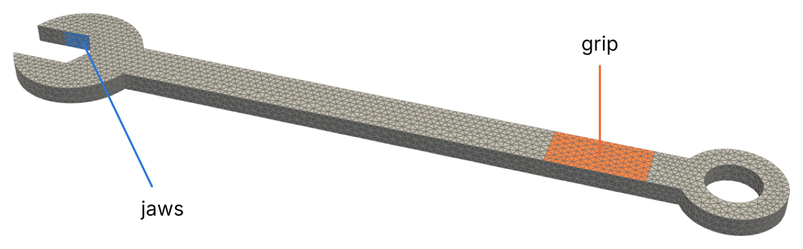
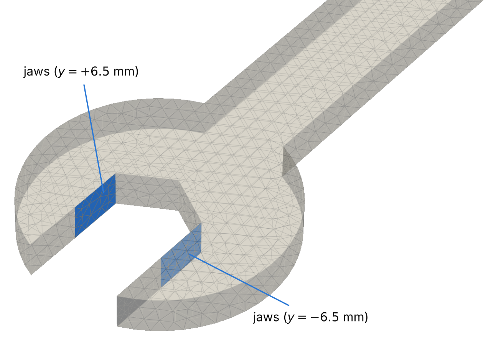
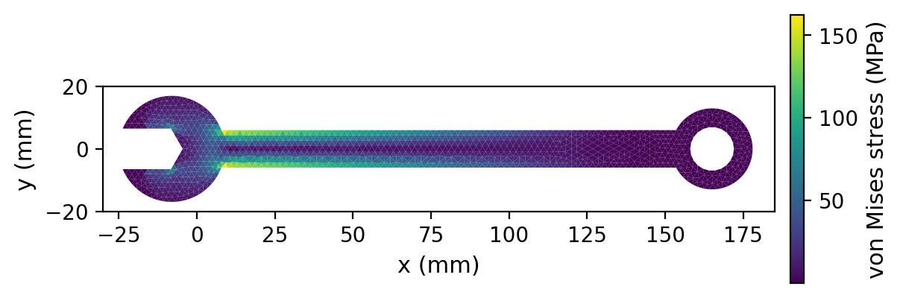

Boundary conditions on an imported mesh: a wrench
=================================================

A mesh generated by the library carries the names of its boundaries, e.g.
``left``, ``right`` and ``top`` for a rectangle.  A mesh imported from a CAD
model or from a mesh generator has an arbitrary shape, and its boundaries
must be named before a boundary condition can act on them.  This tutorial
shows how the boundaries of an imported mesh are named and checked, and how
each boundary condition is defined on them.  The problem is a three-dimensional elasticity problem: a steel
combination wrench that tightens a nut.  The scripts are in
``examples/wrench``.

The problem
-----------

The load case follows the model "Stresses and Strains in a Wrench" of the
COMSOL Application Gallery [COMSOLWrench]_, in which a structural steel
wrench is held by the bolt and loaded by a hand force of 150 N.  The
geometry of that model is distributed only with COMSOL, so the wrench of this
tutorial is built with Gmsh [Gmsh2009]_ by the script
``make_wrench_mesh.py``.  The wrench lies in the :math:`x`-:math:`y` plane and
is 5 mm thick.  The handle has a cross-section of :math:`12 \times 5\
\mathrm{mm^2}` and runs from the head at :math:`x = 0` to the ring end.  The
open end at :math:`x < 0` holds a nut of 13 mm across the flats, whose
centre is at :math:`(-12, 0)` mm.  :numref:`fig-wrench-geometry` shows the
geometry and the boundary conditions.

.. _fig-wrench-geometry:

   The wrench in top view, with dimensions in mm.  The two jaw faces (blue)
   bear on the flats of the rigid nut (hatched) and are held fixed.  The grip
   (orange) carries a uniform traction whose resultant is a force of 150 N in
   the :math:`-y` direction.  The moment arm is the distance from the centre
   of the nut to the centroid of the grip.

The boundary conditions are:

* **The jaws.**  The two flat faces of the open end that bear on the flats of
  the nut are held fixed, i.e., the nut is taken as rigid and the three
  components of the displacement are zero on these faces.
* **The grip.**  The hand applies a force of :math:`F = 150\ \mathrm{N}` in
  the :math:`-y` direction, distributed as a uniform shear traction over the
  upper and lower faces of the handle between :math:`x = 120` and
  :math:`x = 145` mm.
* **All the other faces** are free of traction.

The material is steel with :math:`E = 200\ \mathrm{GPa}` and
:math:`\nu = 0.3`.  The mesh has 9990 quadratic tetrahedra (``Tet10``) and
18 929 nodes, and the problem is solved with the finite element method.

Naming the boundaries
---------------------

**Physical groups of the mesh file.**  The preferred way is to name the
surfaces where the mesh is made.  ``make_wrench_mesh.py`` splits the faces
of the wrench where the flats of the nut end and where the grip begins and
ends, so that the jaws and the grip are surfaces of their own, and declares
them as the physical groups ``jaws`` and ``grip``:

.. literalinclude:: ../../examples/wrench/make_wrench_mesh.py
   :language: python
   :start-at: gmsh.model.addPhysicalGroup(3
   :end-at: "grip")

:func:`~dualmesh.read_mesh` turns every named group of boundary faces into a
side set and a node set of the same name (see :doc:`/user_guide/meshes`).

**Geometric predicates.**  A mesh file without physical groups (e.g., a
volume mesh made from an STL surface by another tool) carries no names.  The
faces are then selected by the position of their centroids with
:meth:`~dualmesh.Mesh.add_sideset_by_predicate`.  The jaws are the faces at
:math:`|y| = 6.5` mm between the ends of the nut flats, and the grip is the
part of the faces :math:`|z| = 2.5` mm between :math:`x = 120` and
:math:`x = 145` mm:

.. code-block:: python

   mm = 1.0e-3
   mesh.add_sideset_by_predicate(
       "jaws", lambda x, y, z: abs(abs(y) - 6.5 * mm) < 1e-6 and -15.76 * mm < x < -8.24 * mm
   )
   mesh.add_sideset_by_predicate(
       "grip", lambda x, y, z: abs(abs(z) - 2.5 * mm) < 1e-6 and 120 * mm < x < 145 * mm
   )

On ``wrench.msh`` the two predicates select exactly the 64 faces of
``jaws`` and the 392 faces of ``grip`` that the physical groups contain.  A
predicate is evaluated only on the exterior faces, so a condition that is
also true inside the body selects no interior faces.  The tolerance must
exceed the round-off of the coordinates, and the boundaries of the selected
region should coincide with edges of the mesh, which is why the mesh
generator splits the faces at the ends of the jaws and of the grip.

The two ways define the same side sets.  A side set is named by one of them
only: a predicate given the name of an existing side set adds its faces to
that side set.

Checking the boundaries
-----------------------

Before a boundary condition is attached, the side sets of an imported mesh
are checked in three steps.

**1. List them.**  :func:`~dualmesh.sideset_summary` prints, for every side
set, the number of faces, the number of nodes, the measure (the area in three
dimensions) and the range of the coordinates of its nodes:

.. code-block:: python

   import dualmesh as dm

   mesh = dm.read_mesh("wrench.msh")
   print(dm.sideset_summary(mesh))

.. code-block:: text

   side set    faces    nodes         area  coordinates of the nodes
   -----------------------------------------------------------------
   grip          392      862       0.0006  x 0.12 to 0.145  y -0.006 to 0.006  z -0.0025 to 0.0025
   jaws           64      158   7.5056e-05  x -0.01575 to -0.008247  y -0.0065 to 0.0065  z -0.0025 to 0.0025

The command line gives the same table from the mesh file, without a
script:

.. code-block:: console

   dualmesh mesh wrench.msh --sidesets wrench_sidesets.vtu

**2. Compare the numbers with the drawing.**  The grip consists of two faces
of :math:`25 \times 12\ \mathrm{mm^2}`, i.e., :math:`A = 6 \times
10^{-4}\ \mathrm{m^2}`, which is the area in the table.  Each jaw is a flat of
the hexagon, of length :math:`13 / (2 \cos 30^\circ) = 7.5056` mm, through
the thickness of 5 mm, and the two jaws have an area of
:math:`7.5056 \times 10^{-5}\ \mathrm{m^2}`.  A side set with the wrong area
or the wrong coordinates has selected the wrong faces.

**3. Look at them.**  :func:`~dualmesh.write_sidesets` writes the exterior
boundary of the mesh to a VTK file with the cell field ``side_set`` (the
position of the side set of each face in :meth:`~dualmesh.Mesh.sideset_names`
plus one, and 0 for a face in no side set) and one field per side set (1 on
its faces and 0 elsewhere):

.. code-block:: python

   dm.write_sidesets(mesh, "wrench_sidesets.vtu")

The option ``--sidesets`` of ``dualmesh mesh`` writes the same file.  In
ParaView the file is
coloured by ``side_set``, or by the field of one side set.
:numref:`fig-wrench-sidesets` and :numref:`fig-wrench-jaws` are renderings of
this file.

.. _fig-wrench-sidesets:

   The surface mesh of the wrench, with the faces of the side set ``jaws``
   in blue and those of ``grip`` in orange.

.. _fig-wrench-jaws:

   The open end of the wrench, drawn semi-transparent, with the two faces of
   the side set ``jaws``.  Each face spans one flat of the nut through the
   whole thickness of the wrench.

Defining the boundary conditions
--------------------------------

The elasticity of the wrench is the ``solid_mechanics`` physics, which
creates the three displacements :math:`u`, :math:`v` and :math:`w`:

.. code-block:: python

   solid = problem.add_physics(
       "solid_mechanics",
       "solid",
       displacements=["u", "v", "w"],
       youngs_modulus=200.0e9,
       poissons_ratio=0.3,
   )

A boundary condition of the physics is defined by three choices: the side set
it acts on, the type of condition, and its value, which for a vector quantity
such as a force has one entry per displacement component.

**The naming rule.**  A condition named after a side set acts on that side
set, so the name ``jaws`` needs no ``boundary`` argument.  An explicit
``boundary`` is given only when the name of the condition differs from the
name of the side set, or when the condition acts on several side sets.

**The jaws: a fixed constraint.**  The nut is taken as rigid and bonded to
the jaws, as in the COMSOL model, so the three displacement components
:math:`u`, :math:`v` and :math:`w` are zero on the jaws.  All three are needed.  With :math:`u` and :math:`v` alone the wrench
could move freely along :math:`z`, and the stiffness matrix would be singular.
The condition ``fixed_constraint`` sets every displacement it lists to zero:

.. code-block:: python

   solid.add_boundary_condition("fixed_constraint", "jaws")

The same constraint can be written as a Dirichlet condition with a zero value
for every component:

.. code-block:: python

   solid.add_boundary_condition("Dirichlet_boundary_condition", "jaws", value=[0.0, 0.0, 0.0])

The two forms define the same constraint, so a boundary is given one of them
and never both.  A component that is left free is given the value ``None``,
e.g., ``value=[0.0, None, 0.0]``.

**The grip: a traction given by its total force.**  The hand pulls the
handle in the :math:`-y` direction.  The condition acts on the equation of
the :math:`y` displacement, :math:`v`, and leaves :math:`u` and :math:`w`
free of load.  The ``traction_boundary_condition`` accepts the total force on
the side set, here :math:`\mathbf{F} = (0, -150, 0)\ \mathrm{N}`, and spreads
each component uniformly over the area :math:`A` of the side set:

.. code-block:: python

   solid.add_boundary_condition("traction_boundary_condition", "grip", total_force=[0.0, -150.0, 0.0])

The traction applied on every face of the grip is

.. math::

   t_y = \frac{F_y}{A} = \frac{-150\ \mathrm{N}}{6 \times 10^{-4}\ \mathrm{m^2}}
       = -2.5 \times 10^{5}\ \mathrm{Pa},

where :math:`F_y` is the total force and :math:`A` is the area of the side
set, computed by the code (:meth:`~dualmesh.Problem.boundary_measure`).  The
same load can be given as the traction itself, in force per unit area:

.. code-block:: python

   solid.add_boundary_condition("traction_boundary_condition", "grip", traction=[0.0, -2.5e5, 0.0])

``traction`` and ``total_force`` define the same load, so a condition gives
one of them and never both, and the code refuses a condition that gives both.
The total force is preferable when the force is the known quantity, because
the area of the faces of an imported mesh is then never computed by hand.  A
traction that varies over the faces is given as ``traction`` with a function
of :math:`x`, :math:`y`, :math:`z` and :math:`t`.

**The free faces: the natural condition.**  All the faces that belong to no
condition, i.e., every face except the jaws and the grip, are free of
traction.  The free surface is the natural boundary condition of the weak
form of the equilibrium equations, and it needs no input.

The Python script
-----------------

The complete function that builds and solves the problem is:

.. literalinclude:: ../../examples/wrench/wrench.py
   :language: python
   :pyobject: solve

The solution has a total reaction of 150.0 N on the jaws and a largest
deflection of 1.174 mm.

Results and verification
------------------------

``wrench.py`` compares the solution with three results that do not depend on
the finite element model:

.. list-table::
   :header-rows: 1
   :widths: 50 20 30

   * - Quantity
     - dualmesh
     - Reference
   * - Reaction on the jaws in :math:`y`
     - 150.0 N
     - :math:`F = 150` N (equilibrium of forces)
   * - Moment of the reactions about the centre of the nut
     - 21.675 N m
     - :math:`F (x_g - x_n) = 21.675` N m
   * - Bending stress :math:`\sigma_{xx}` of the handle at :math:`x = 60` mm
     - 90.58 MPa
     - 90.63 MPa (beam theory)

The moment arm is the distance from the centre of the nut,
:math:`x_n = -12` mm, to the centroid of the grip, :math:`x_g = 132.5` mm.
The bending stress of the handle follows from beam theory as

.. math::

   \sigma_{xx} = \frac{M c}{I} = \frac{F (x_g - x)\, (h/2)}{b h^3 / 12},

where :math:`M` is the bending moment at the section :math:`x`, :math:`h =
12` mm is the width of the handle in the plane of bending, :math:`b = 5` mm
is its thickness, :math:`c = h/2` is the distance from the neutral axis to
the edge, and :math:`I` is the second moment of area.  The computed value is
the slope of a linear fit of :math:`\sigma_{xx}` against :math:`y` over the
elements within 3 mm of the section, multiplied by :math:`h/2`.  The two
values differ by 0.06 %.

   The von Mises stress on the upper face of the wrench (one value per
   element).  The stress grows linearly along the handle from the grip
   towards the head, as the bending moment does, and is highest at the
   junction of the handle and the head.

The largest von Mises stress, 188.7 MPa, lies at the junction of the handle
and the head (:math:`x = 8.4` mm, :math:`|y| = 5.5` mm), where the straight
edge of the handle meets the circle of the head at a sharp re-entrant
corner.  Beam theory gives 155 MPa at this section, and the difference is the
stress concentration of the corner.  The stress at a sharp re-entrant corner
of an elastic body is singular, so this value grows as the mesh is refined.
A real wrench has a fillet at this junction, whose radius sets the stress
concentration.  The edges of the fixed jaws are also singular, as is every
edge where a clamped face meets a free face.

The results are written to ``wrench_fem.vtu``, which ParaView opens, and
``python wrench.py fem --figure`` also draws the figure above.  The figures of
the geometry and of the side sets are drawn by ``plot_wrench_geometry.py``.
