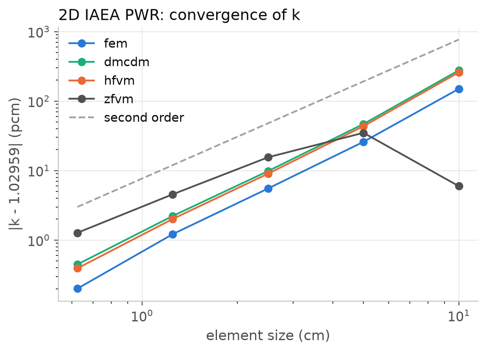
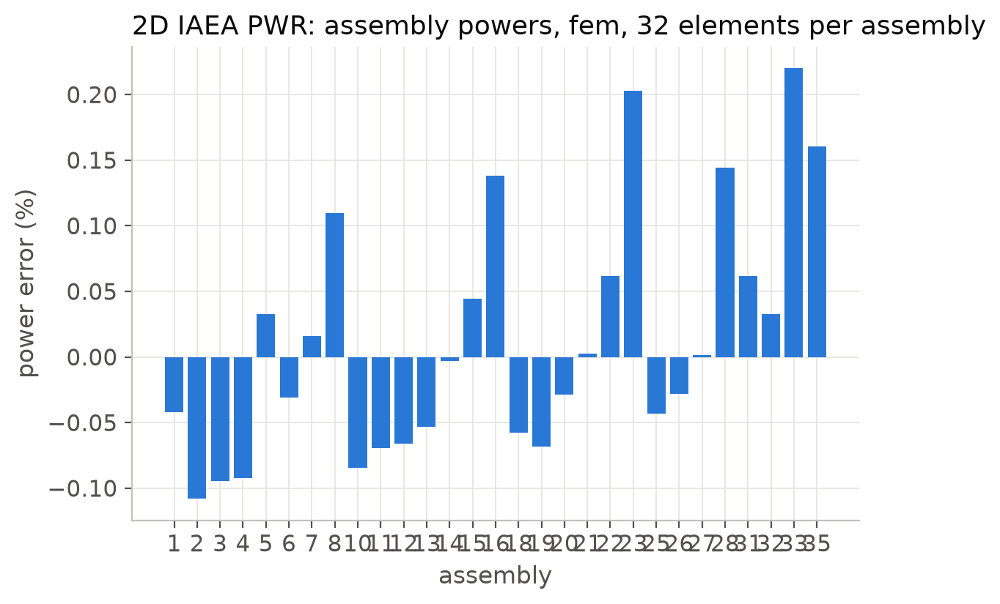

Verification
============

Every number this library produces for a published problem is checked against
the published value.  The suite in ``tests/python`` reproduces the dual mesh
control domain results of Reddy's book chapter by chapter.  The directory
``tests/cpp`` holds the structural tests that do not depend on a published
table.  A manufactured-solution study measures the order of convergence of
every method on every element type, and :doc:`openfoam` compares the solvers
with an independent code.

.. code-block:: console

   pytest                                       # the verification suite
   ctest --test-dir build --output-on-failure   # the C++ unit tests

What is covered
---------------

.. list-table::
   :header-rows: 1
   :widths: 22 48 30

   * - Source
     - Problem
     - What is checked
   * - Example 3.3.1
     - :math:`-u'' = 10\cos x`, Dirichlet and mixed cases, four elements,
       trapezoidal source rule
     - nodal values (both cases)
   * - Example 5.3.1, Table 5.3.1
     - cooling fin :math:`-u'' + 400u = 0` with a convective end
     - nodal values on 5, 10 and 20 elements, and the heat flow :math:`Q(0)`
   * - Example 5.3.2
     - axisymmetric conduction in a cylinder with heat generation
     - exact nodal values, and :math:`Q(R_0) = \pi R_0^2 g_0`
   * - Example 5.4.1, Table 5.4.1
     - conduction in a :math:`3a \times 2a` rectangle with insulated edges
     - the :math:`3 \times 2` nodal values, the :math:`6 \times 4` and
       :math:`12 \times 8` tables, and the identity of the dual mesh and finite
       element solutions on triangles
   * - Example 5.4.2, Table 5.4.2
     - conduction with a parabolic edge temperature
     - both tabulated rows (:math:`8 \times 8` mesh)
   * - Example 5.4.3, Table 5.4.3
     - bus bar with heat generation and surface convection
     - both tabulated rows, to every printed digit
   * - Example 5.4.4, Table 5.4.4
     - advection-diffusion at :math:`Pe = 75` on :math:`50 \times 50` and
       :math:`100 \times 100` meshes
     - the diagonal profile, to :math:`2\times10^{-5}`
   * - Example 6.2.2
     - :math:`-u'' + 2u^3 = 0` with a nonlinear flux condition
     - nodal values on 4 and 8 elements
   * - Example 6.2.3, Table 6.2.2
     - conduction with :math:`k(T) = k_0(1 + k_1 T)`
     - nodal values on 4 and 8 elements
   * - Example 6.2.4
     - large-deformation bar, :math:`a(u') = EA(1 + 1.5u' + 0.5u'^2)`
     - tip displacement at three load levels (a kernel written in Python)
   * - Example 6.3.1, Table 6.3.1
     - two-dimensional nonlinear conduction
     - both tabulated rows, with Newton's method and with direct iteration
   * - Example 6.3.2
     - nonlinear bus bar, :math:`k = 20 + 0.2T`
     - the linear and nonlinear nodal values
   * - Tables 7.5.1–7.5.4
     - pinned and clamped beams, three dual mesh models, four meshes
     - centre deflections, and the exact centre moment of the mixed models
   * - Table 7.5.3
     - functionally graded beams, seven power-law indices
     - normalized centre deflections for all three models
   * - Table 7.6.1
     - von Kármán bending of a pinned beam, six load levels
     - centre deflections with Newton's method and with direct iteration
       (:math:`\gamma = 0.35`)
   * - Table 8.6.1
     - hinged circular plate, five meshes
     - centre deflection, and agreement with the analytical solution
   * - Table 8.6.2
     - clamped functionally graded circular plate, ten power-law indices
     - centre deflections (32 elements)
   * - Table 9.8.1
     - plate under a uniform edge load, four meshes
     - displacements and element-centre stresses
   * - Example 9.8.1
     - uniform edge stress
     - :math:`u = t_0 a / E` exactly, and an exactly uniform stress
   * - Table 9.8.2
     - creeping flow squeezed between plates (:math:`20 \times 16` graded mesh)
     - the horizontal velocity profiles at two stations, and the recovered
       pressure
   * - Table 9.8.3
     - lid-driven cavity at :math:`Re = 0` and :math:`Re = 1000`
     - the centreline profile for both, by load stepping and by direct
       iteration
   * - Table 9.9.1
     - pressurized thick cylinder, quadrilateral and triangular meshes
     - radial displacements, and monotone convergence to the Lamé solution
   * - Table 10.5.1
     - clamped functionally graded plate, six power-law indices, four meshes
     - normalized centre deflections

Additional checks that do not depend on a published table are the patch test on
distorted meshes of every element type, the geometric closure of the dual mesh
(the control volumes partition each element and their interface areas balance),
exactness
of the automatic differentiation, exactness of the Gauss rules, global
conservation of the reactions, the stress concentration factor of a plate with
a hole, the transient solution against a Fourier series, the equivalence of the
dual mesh and finite element methods on simplices, and the effect of reduced
integration on shear locking in beams and plates.

Agreement
---------

Where the mesh and the data are fully specified, the code reproduces the
published values to the last printed digit.  Two classes of small differences
remain, both documented in the tests:

* **Rounding.** The book prints four or five decimals, so the tests accept a
  difference of one unit in the last printed digit (e.g., :math:`1.1\times10^{-4}`
  for Table 7.5.1).
* **Meshes that the text does not fully specify.** For the pressurized cylinder
  (Table 9.9.1) the book gives the number of subdivisions across the wall and
  the total element count, without the exact circumferential distribution, and
  for triangles it does not state how the quadrilaterals are split.  The tests
  therefore compare the quadrilateral results within half a percent and, in
  addition, check monotone convergence to the analytical solution for both
  element types.

Two discrepancies in the book
-----------------------------

Two published values differ from the values computed by this code, and in both
cases the evidence indicates an error in the book's table.

1. **Table 5.4.2, last entry.**  The table gives the dual mesh temperature at
   :math:`(x, y) = (0.175, 0.05)` as 335.34 K.  Every other entry of that table
   is reproduced here to the last printed digit, the finite element value at
   the same point is 335.49 K, and the dual mesh solution is above the finite
   element solution at every other point of the table.  This code gives
   335.545 K, which suggests that 335.34 is a typographical error for 335.54.

2. **Table 5.4.3, caption.**  The table is captioned
   ":math:`20 \times 10` mesh", but Fig. 5.4.15(b) shows a :math:`10 \times 5`
   primal mesh, and Example 6.3.2 quotes the same numbers for its
   :math:`10 \times 5` mesh.  On a :math:`10 \times 5` mesh this code reproduces
   all eighteen tabulated values to every printed digit.  On a
   :math:`20 \times 10` mesh the values differ in the second decimal.  The data
   therefore come from the :math:`10 \times 5` mesh of the figure.

Order of accuracy: manufactured solutions
-----------------------------------------

A published table checks a discretisation at one mesh.  Whether it converges,
and at the rate its theory predicts, is checked by the **method of
manufactured solutions** [Roache2002]_ [SalariKnupp2000]_.  A smooth function
:math:`u^\star(\mathbf{x}, t)` is chosen, which need not satisfy any physical
problem.  The governing operator is applied to it symbolically, and the result,
:math:`f = -\nabla \cdot \mathbf{F}(u^\star) + S(u^\star)`, is added to the
problem as a source, so that :math:`u^\star` is its exact solution.  The
boundary values are taken from :math:`u^\star` as well.  Solving on a sequence
of meshes of size :math:`h` then gives the error :math:`e_h = u_h - u^\star`
exactly, and its observed order between two meshes is

.. math::

   p = \frac{\ln \left( \lVert e_{h_1} \rVert / \lVert e_{h_2} \rVert \right)}
            {\ln (h_1 / h_2)} .

:mod:`dualmesh.mms` does the symbolic work with SymPy: a
:class:`~dualmesh.mms.ManufacturedSolution` holds the exact fields and the
physics of the equations, added with ``add_physics`` as to a problem
(``coefficient_form_PDE`` for diffusion with a variable or solution-dependent
coefficient, convection in either form, absorption and the time derivative,
``heat_transfer``, ``solid_mechanics`` and ``incompressible_flow``).  Each
physics states, in SymPy, the flux and the source of the objects it
generates, so that the forcing is derived from the equations the code
assembles.  The study derives the forcing, including the metric factors of the
axisymmetric and spherical divergences, and runs the convergence study.  The
errors are measured by :meth:`~dualmesh.Problem.error_norms` in the two norms
in which the convergence theory of every method is stated,

.. math::

   \lVert e \rVert_{L^2} = \Bigl( \int_\Omega e^2 \, dV \Bigr)^{1/2} ,
   \qquad
   \lvert e \rvert_{H^1} = \Bigl( \int_\Omega \lvert \nabla e \rvert^2 \, dV \Bigr)^{1/2} ,

where :math:`u_h` is the field each method represents: the element
interpolation of the nodal values for the node-based methods, and the linear
reconstruction :math:`U_c + \mathbf{G}_c \cdot (\mathbf{x} - \mathbf{x}_c)` in
every cell for the cell-centred method.

**Expected orders.**  For an element of polynomial order :math:`p`:

====================  =================  ====================
Method                :math:`L^2` error  :math:`H^1` seminorm
====================  =================  ====================
``fem``               :math:`p + 1`      :math:`p`
``dmcdm``, ``hfvm``   2                  :math:`p`
``zfvm``              2                  1
====================  =================  ====================

The first row is classical finite element theory, the extra order in
:math:`L^2` coming from the duality argument of Aubin and Nitsche
[Aubin1967]_ [Nitsche1968]_.  The control volume methods are optimal in the
energy seminorm, but their :math:`L^2` order remains 2 on quadratic elements,
because a control volume balance is not a Galerkin projection
(:doc:`theory/elements` explains where the interfaces lie and why their
position matters).  The cell-centred method carries one value per cell whatever the
element and reconstructs a linear field from it, so the element order improves
only its geometry.

**Coverage.**  ``tests/python/test_mms.py`` runs 161 convergence studies.  They
cover the four methods on every element type each accepts, in one, two and
three dimensions, and in Cartesian, axisymmetric and spherical coordinates.
They include variable, solution-dependent (nonlinear) and constant
coefficients, advection in the conservative and the non-conservative form with
reaction, the transient problem with the time step refined with the mesh
(Crank-Nicolson, :math:`\Delta t = h/4`), and plane-strain, plane-stress,
axisymmetric and three-dimensional elasticity.  Every mesh sequence is a
structured grid mapped by a smooth nonlinear transformation, so that no element
is a parallelogram and the rates are those of a general mesh.  A rate is
accepted within 0.2 below and 0.4 above the expected one.  The upper margin
allows for the pre-asymptotic behaviour of a method converging to a lower
order.

**Results.**  The observed orders on the finest pair of meshes for the diffusion
problem with a variable coefficient, as :math:`L^2` / :math:`H^1`, are:

============  =============  =============  =============  =============
Element       ``fem``        ``dmcdm``      ``hfvm``       ``zfvm``
============  =============  =============  =============  =============
``Tri3``      1.99 / 1.00    1.99 / 1.00    1.99 / 1.00    2.00 / 1.00
``Quad4``     2.00 / 1.00    2.00 / 1.00    1.99 / 1.00    2.00 / 1.00
``Tri6``      3.00 / 1.99    2.01 / 1.99    2.04 / 1.99    2.00 / 1.00
``Quad8``     3.00 / 2.00    n/a            n/a            2.00 / 1.00
``Quad9``     3.00 / 2.00    2.05 / 2.00    2.23 / 2.00    2.00 / 1.00
``Tet4``      1.94 / 0.98    1.96 / 0.98    1.96 / 0.98    1.97 / 0.98
``Hex8``      1.99 / 1.01    2.00 / 1.01    1.98 / 1.01    1.97 / 0.99
``Wedge6``    1.95 / 0.98    1.96 / 0.98    1.96 / 0.98    1.98 / 0.99
``Pyramid5``  1.99 / 1.00    n/a            n/a            1.98 / 0.99
``Tet10``     3.00 / 1.96    2.66 / 1.96    2.86 / 1.89    1.95 / 0.97
``Hex20``     3.06 / 2.08    n/a            n/a            1.94 / 0.98
``Hex27``     2.99 / 2.00    2.72 / 2.00    2.96 / 2.00    1.94 / 0.98
============  =============  =============  =============  =============

The two-dimensional sequences use :math:`4, 8, 16, 32` elements per side.  The
three-dimensional sequences use :math:`3, 6, 12` for the linear elements and
:math:`2, 4, 8` for the quadratic ones.  On these coarser three-dimensional
meshes the quadratic control volume rates are pre-asymptotic: they lie between
the finite element method's 3 and their asymptotic value of 2, which the
two-dimensional sequences, reaching finer meshes, show at 2.0.  Every entry
agrees with the table of expected orders.  The complete study runs in about
80 seconds.

A user-defined study requires only a few lines:

.. code-block:: python

   import dualmesh as dm
   from dualmesh import mms

   study = mms.ManufacturedSolution({"u": "sin(pi*x)*cos(pi*y) + x*y"}, dimension=2)
   study.add_physics("coefficient_form_PDE", "diffusion", diffusion_coefficient="1 + 0.5*x*y")
   result = study.convergence_study(
       lambda n: dm.generate_rectangle_mesh(0, 1, 0, 1, n, n, element_type="Tri6"),
       [4, 8, 16, 32],
       method="fem",
   )
   print(result.table())  # errors and observed orders

Reactor criticality: the 2D IAEA PWR benchmark
----------------------------------------------

The two-dimensional IAEA PWR benchmark is a quarter of a PWR core
([ANL7416]_, problem 11-A2).  The core has 177 fuel assemblies of
:math:`20\ \mathrm{cm}`, two fuel compositions and nine fully rodded
assemblies.  A water reflector of :math:`20\ \mathrm{cm}` surrounds the core.
The model is two-group diffusion theory with an axial buckling of
:math:`0.8 \times 10^{-4}\ \mathrm{cm}^{-2}` in all regions and groups.
The outer boundary has no incoming current, which the benchmark gives as
:math:`\partial \phi_g / \partial n = -0.4692\, \phi_g / D_g`.  The script
``verification/benchmarks/neutronics/run_iaea_2d_pwr.py`` writes the
two-group equations with ``coefficient_form_PDE`` (see
:ref:`tutorial-criticality`), and this condition as a
``Robin_boundary_condition`` with the transfer coefficient
:math:`1/2.1312`.  The reference is the extrapolated finite-difference
solution of problem 11-A2-1: :math:`k_\mathrm{eff} = 1.02959` (Table 1) and
the zone average thermal fluxes (Table 3).  The assembly powers follow from
these fluxes and are normalised to a core average of one.

:numref:`iaea-2d-results` gives the error of :math:`k_\mathrm{eff}` and
of the assembly powers.  Each 20 cm assembly has :math:`m \times m`
square elements.

.. _iaea-2d-results:

.. table:: The 2D IAEA PWR benchmark: error of :math:`k_\mathrm{eff}` (pcm)
   and largest error of the assembly powers (%) for :math:`m \times m`
   elements per assembly.

   ======  ===============  ===============  ===============  ===============
   m       ``fem``          ``dmcdm``        ``hfvm``         ``zfvm``
   ======  ===============  ===============  ===============  ===============
   4       25.9 / 8.38      46.8 / 12.4      43.5 / 12.9      -35.0 / 13.9
   8       5.5 / 2.18       9.9 / 3.21       9.0 / 3.39       -15.6 / 5.17
   16      1.2 / 0.61       2.2 / 0.87       2.0 / 0.92       -4.6 / 1.44
   32      0.2 / 0.22       0.4 / 0.29       0.4 / 0.30       -1.3 / 0.34
   ======  ===============  ===============  ===============  ===============

All four methods converge to the reference.  The node-based methods converge
at second order in the element size.  At :math:`m = 32` their error of
:math:`k_\mathrm{eff}` is less than 0.5 pcm, and their largest error of the
assembly powers is less than 0.3 %.  The cell-centred method approaches
second order on the finer meshes.  Its error of :math:`k_\mathrm{eff}` has
the opposite sign.

   The 2D IAEA PWR benchmark: error of :math:`k_\mathrm{eff}` against the
   element size.

   The 2D IAEA PWR benchmark: error of the assembly powers with ``fem`` and
   32 elements per assembly.

Coupled problems
----------------

The natural convection benchmark of de Vahl Davis [DeVahlDavis1983]_ checks a
two-way coupled problem (``tests/python/test_multiphysics.py``): the average
Nusselt number and the velocity maxima of the square cavity at Rayleigh
numbers from :math:`10^3` to :math:`10^5`, with the dual mesh, finite element
and vertex-centred finite volume methods, and the quadratic convergence of
Newton's method on the coupled system.  The numbers are in
:doc:`theory/heat_and_fluids`.

Reproducing a single case
-------------------------

Every test is an ordinary function, so a case can be run on its own:

.. code-block:: console

   pytest tests/python/test_heat_transfer.py -k example_5_4_3 -v
   pytest tests/python/test_beams.py -k table_7_5_1 -v

and the ``examples`` directory holds stand-alone scripts for several of them.
